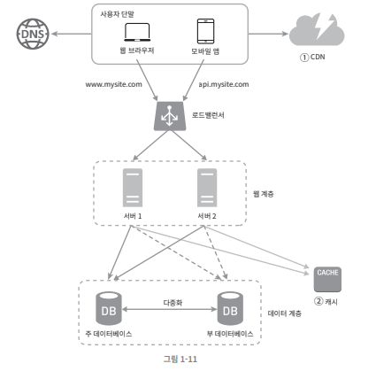
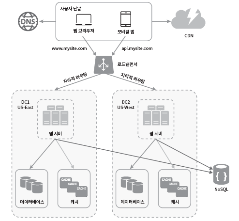
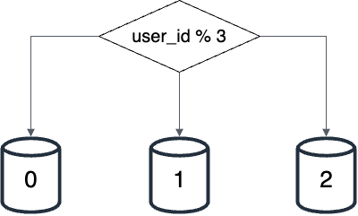

# 1. 사용자 수에 따른 규모 확장성

- 이 장을 통해, 규모 확장성과 관계된 설계 문제를 푸는 데 쓰일 유용한 개념들을 배웁니다.

 
 
 
 

# **단일서버의 개념**

- 웹 앱, DB, Cache 등이 전부 서버 한대에서 실행됩니다.

 
 

# **서버의 통신 순서**

- 사용자가 DNS에 도메인에 대한 IP를 요청한다 → DNS로 부터 IP를 수신받고 해당 IP주소로 HTTP 요청을 전달 한다 → 요청 받은 웹 서버는 HTML or JSON 형태의 응답을 반환

 
 

# **데이터베이스**

- 사용자가 늘면 서버 하나로 충분치 않아 여러 서버를 두는데, 하나는 웹/앱 트래픽 처리용도로 쓰고, 하나는 데이터베이스 용도로 써야 합니다. 이렇게 **웹/모바일 트래픽 처리 서버와 데이터베이스 서버를 분리하면 각각을 독립적으로 확장해 나갈 수 있습니다**.
- 데이터 베이스는 관계, 비관계로 나뉘는데 보통 관계형 데이터베이스(RDBMS)를 많이 쓰지만 특정 상황에 비 관계형 데이터 베이스를 써야할 수 있습니다.
- **비 관계형 데이터베이스 고려 상황**
  - 아주 낮은 응답 지연시간이 요구될 때.
  - 다루는 데이터가 비정형이라 관계형 데이터가 아닐 때
  - 데이터(JSON, YAML, XML ..)를 직렬화하거나 역직렬화 할 수 있기만 하면 될 때
  - 아주 많은 양의 데이터를 저장할 필요가 있을 때
- **수직적 규모 확장 vs 수평적 규모 확장**
  - **수직적 규모 확장 :** Scale Up이라 하고, 서버를 더 고사양 자원( 고사양 CPU, RAM 등)을 추가하는 행위입니다.
    - **장점 :** 서버 유입 트래픽이 적을 때 단순하게 성능 향상 가능
    - **단점 :** Scale Up에는 한계가 있음 / 장애에 대한 자동복구(FailOver) 방안이나 다중화 방안을 제시 할 수 없음
  - **수평적 규모 확장 :** Scale Out이라 하고, 더 많은 서버를 추가하여 성능을 개선하는 행위
    - **장점 :** 대규모 애플리케이션을 지원하는데 적합

 
 

# **로드밸런서**

- **역할**
  - 요청 트래픽 부하를 여러 서버에 고르게 분산하는 역할을 합니다.
- **서버 접속 순서**
  - 사용자는 DNS로부터 로드밸런서의 공개 IP주소를 받고 로드밸런서에 접속 요청을 보냅니다.
- **특징**
  - 로드밸런서를 통해 트래픽을 처리하면, 웹 서버는 클라이언트의 접속을 직접 처리하지 않습니다.
  - 보안을 위해 서버 간 통신에는 사설 IP 주소가 사용됩니다. 이는 같은 네트워크에 속한 서버 사이의 통신에만 쓰일 수 있는 IP주소로, 인터넷을 통한 접속이 불가합니다. 이렇게 같은 서버를 여러개 띄워 놓고 로드밸랜서로 트래픽을 분산 처리하면 자동복구 문제가 해결됩니다.

 
 

# **데이터베이스 다중화**

- **데이터베이스 다중화의 필요성**
  - 웹서버는 여러개 띄워서 로드밸런서로 해결했지만 데이터베이스는 하나 뿐인데 이를 해결하기 위해 데이터베이스 다중화가 필요합니다.
- **데이터베이스 다중화 방법**
  - 많은 DB가 다중화를 지원하며, 보통 서버 사이에 주-부 관계를 설정하고 데이터 원본은 **[주-데이터베이스]** 에, 사본은 **[부-데이터베이스]** 에 저장합니다. 쓰기는 **[주-데이터베이스]** 만 가능하고 **[부-데이터베이스]** 는 그 사본을 전달 받고, 읽기 연산만을 지원합니다. 보통 서버는 조회 연산이 많으므로 **[주-데이터베이스]** 보다 **[부-데이터베이스]** 가 많습니다.
    - **주-DB** : insert, update, delete 연산
    - **부-DB** : select 연산
- **다중화 장점**
  - **성능 향상 :** 읽기 연산이 **[부-데이터베이스]** 로 분산되기 때문에 성능이 좋아집니다.
  - **안정성 :** 재해 등으로 DB일부가 상해도 지역을 다르게 다중화 할 경우 보다 안전합니다.
  - **가용성 :** 데이터를 여러 지역에 둠으로써 하나가 고장나도 다른 서버에서 가져와 쓸 수 있습니다.
- **주-데이터베이스 손상시**
  - **[부-데이터베이스]** 가 **[주-데이터베이스]** 역할을 하는데, **[부-데이터베이스]** 의 데이터가 최신이 아닐 수 있습니다. 이 때 복구 스크립트를 돌리거나, 다중 마스터, 원형 다중화 방식을 도입하면 이런 상황에 대처 할 수 있습니다.

 
 

# **캐시**

- **캐시란?**
  - 값비싼 연산 결과나 자주 참조되는 데이터를 메모리 안에 두고 요청이 빨리 이뤄질 수 있게 하는 장소입니다.
- **캐시 계층**
  - 별도의 캐시 계층 사용시 데이터 베이스 부하가 줄고, 캐시 계층의 규모를 독립적으로 확장할 수 있습니다.
    - **캐시 우선 읽기 전략 :** 웹 서버가 요청을 받으면 캐시를 먼저 확인하고 데이터가 있으면 바로 반환하고 없으면 DB에서 읽어와 캐시에 저장하고 사용자에게 반환합니다.
- **캐시 사용시 고려할 점**
  - **어떤 상황에서 ? :** 데이터 갱신은 자주 일어나지 않지만 참조는 빈번하게 일어날 때 필요
  - **어떤 데이터를 ? :** 캐시는 휘발성이라 영속성이 필요한 데이터는 불가
  - **만료 시간은 ? :** 만료된 데이터는 캐시에서 삭제해야 함. 너무 길면 원본과의 차이가, 너무 짧으면 DB를 자주 접근하는 문제 발생
  - **일관성은 ? :** 저장 원본을 갱신하는 연산과 캐시 갱신 연산을 같이 해놓으면 일관성 유지 가능
  - **장애 대처는 ? :** 캐시 서버가 한대만 있으면 SPOF(single point of failure)가 되버릴 가능성이 존재하기에, SPOF을 피하기 위해 여러 지역에 걸쳐 캐시 서버를 분산 가동 해야함
  - **캐시 메모리 크기는 ? :** 너무 작으면 데이터가 밀려나버려 성능이 저하됨. 캐시 메모리 크기는 과할당(overprovision)하는 것이 좋음
  - **캐시 데이터 방출 정책은 ? :** 캐시가 꽉 찼는데 데이터를 더 넣어야 할때, 기존 데이터를 삭제 해야하는데 이를 데이터 방출 정책이라 함. 보통 **LRU**를 쓰고, **LFU, FIFO도 사용.**

 
 

# **콘텐츠 전송 네트워크(CDN)**

- **CDN이란 ?**
  - 정적 콘텐츠(JS, CSS, Image등)를 전송하는 데 쓰이는, 지리적으로 분산된 서버의 네트워크입니다.
- **작동 방식**
  - 사용자가 웹사이트 방문시 그 사용자에게 지리적으로 가까운 CDN서버가 정적 콘텐츠를 전달합니다.
- **CDN 사용시 고려할 점**
  - **비용은 ? :** CDN은 보통 제3 사업자(Cloudflare)에 의해 운영되며, CDN으로 들어오고 나가는 데이터 전송 양에 따라 과금됩니다. 자주 사용하지 않으면 이득이 없으므로 빼도록 합니다.
  - **적절한 만료 설정이 중요**
  - **장애 대처 방안 :** CDN 자체가 죽었을 경우 웹/애플리케이션이 어떻게 동작해야 하는지 고려해야 합니다. CDN서버가 응답하지 않으면 해당 문제를 감지하여 원본 서버에 요청을 보내도록 클라이언트를 구성해야 합니다.

 
 

# 로드밸런서, 다중 서버, DB 다중화, 캐시, CDN이 적용된 사진입니다.

 
 

# 무상태(stateless) 웹 계층

- 웹 계층을 수평적으로 확장하기 위해서는 상태 정보(사용자 세션 데이터 등)를 웹 계층에서 제거해야 합니다. 상태 정보를 RDBMS나 NoSQL 같은 저장소에 보관하고 필요시 가져오는 것으로 해야 합니다.
- 상태 정보를 각 서버에 저장하면, 서버가 여러개일 때 요청이 특정 서버에 보내져야만 응답이 가능한 문제가 있습니다. 로드밸런서가 고정 세션 이라는 기능을 통해 이 문제가 해결되나 로드밸런서에 부담이 갑니다.
- **무상태 웹계층의 구성도**

 
 

# 데이터 센터

- **데이터 센터의 필요성**
  - 가용성이 높고, 전 세계 어디서든 쾌적하게 사용할 수 있도록 하기 위해 여러 데이터 센터를 지원하는 것은 필수 입니다.
- **다중 데이터센터 아키텍처 구현의 난제**
  - **트래픽 우회 :** 올바른 데이터 센터로 트래픽을 보내는 효과적인 방법을 찾아야 합니다. GeoDNS는 사용자에게 가장 가까운 데이터센터로 트래픽을 보냅니다.
  - **데이터 동기화 :** 데이터 센터마다 별도의 DB를 둘 경우 데이터 센터마다 데이터가 다르게 됩니다. 이를 해결하기 위해 데이터를 여러 데이터센터에 걸쳐 다중화 합니다.
  - **테스트와 배포 :** 웹/애플리케이션 수정시 여러 위치에서 테스트해보는 것이 중요하며 자동화된 배포 도구는 모든 데이터 센터에 동일한 서비스가 설치되는데 도움을 줍니다.

 
 

# 메시지 큐

- **메시지 큐란 ?**
  - 시스템을 더 큰 규모로 확장하기 위해서는 시스템의 컴포넌트를 분리해 각기 독립적으로 확장될 수 있도록 해야합니다. 메시지 큐는 이 문제를 풀기 위해 사용하는 핵심 전략입니다.
  - 메시지 큐는 메시지의 무손실을 보장하는 비동기 통신 지원 컴포넌트입니다.
- **메시지 큐 아키텍처**
  - **생산자 :** 메시지 생성 후 발행(publish)하는 역할
  - **소비자/구독자 :** 메시지를 받아 동작을 수행하는 역할
- **메시지 큐 장점**
  - 메시지 큐 사용시 서버간 결합이 느슨해져 규모 확장성이 보장되어야 하는 안정적인 애플리케이션 설계가 가능합니다.
  - 생산자는 소비자가 다운되어도 메시지 발행이 가능하고, 소비자는 생산자가 가용상태가 아니더라도 메시지를 수신할 수 있습니다.

 
 

# 로그, 메트릭, 자동화

- **로그**
  - 에러 로그를 서버 단위로 모니터링 할 수도 있지만, 로그를 단일 서비스로 모아주는 도구를 활용하면 편리하게 조회/검색이 가능합니다.
- **메트릭의 종류( 특정 데이터를 측정하는 것 )**
  - **호스트 단위 메트릭 :** CPU, 메모리, 디스크I/O에 관한 메트릭
  - **종합 메트릭 :** DB계층의 성능, 캐시 계층 성능에 관한 메트릭
  - **핵심 비즈니스 메트릭 :** DAU(Daily Active User), 수익(rev-enue), 재방문(retention) 메트릭
- **자동화**
  - 생산성 향상을 위해 CI/CD를 도입할 수 있습니다.

 
 

# 데이터베이스의 규모 확장

- **수직적 확장**
  - Scale UP이라하며, 기존 서버에 고성능 자원을 증설하는 방법입니다. 이 방법에는 한계가 있으며 SPOF(Single Point Of Failure)로 인한 위험성이 있으며, 비용도 많이 듭니다.
- **수평적 확장**
  - **샤딩(Sharding) :** 더 많은 서버를 추가함으로써 성능을 향상시키는 것으로 대규모 데이터베이스를 샤드(Shard)라 부르는 작은 단위로 분할하는 기술을 말합니다. 모든 샤드는 같은 스키마를 쓰지만 샤드에 보관되는 데이터 사이에는 중복이 없습니다.
  - 아래는 user_id를 샤딩 키로하여 해쉬함수를 통해 저장할 샤드를 구해 저장하는 방식의 예시 사진입니다.
  
  
  
  - **샤딩 키(Sharding key) :** 샤딩 키는 파티션 키라고도 부르며 데이터가 어떻게 분산될지 정하는 하나 이상의 컬럼으로 구성됩니다. 샤딩 키를 정할 때는 데이터를 고르게 분할 할 수 있도록 하는 게 가장 중요합니다.
  - **샤딩의 문제점**
    - **데이터 재 샤딩 문제**
      - 데이터가 너무 많아 기존 샤드로 불가능할 때 혹은 샤드 간 데이터 분포가 고르지 못해 하나의 샤드가 꽉찬 경우 샤드 키 계산 함수를 변경하고 데이터를 재분배 해야합니다. 이 문제는 안정 해시(Consistent Hashing)기법을 통해 해결합니다.
    - **유명인사 문제**
      - 핫스팟 키 문제라고도 하며 특정 샤드에 질의가 집중되 서버 과부하가 일어나는 것을 의미합니다. 데이터를 적절이 분배하는게 중요합니다.
    - **조인과 비정규화 문제**
      - DB를 여러 샤드 서버로 쪼개면 여러 샤드에 걸친 데이터를 조인하기 힘들어지기 때문에 DB를 비정규화하여 하나의 테이블에서 질의가 수행될 수 있도록 해야할 필요가 있습니다.

 
 

# 정리

- 웹 계층은 무상태 계층으로!
- 모든 계층에 다중화 도입!
- 가능한 한 많은 데이터를 캐시!
- 여러 데이터 센터를 지원할 것!
- 정적 콘텐츠(JS,CSS,IMAGE)는 CDN을 통해 서비스!
- 데이터 계층은 샤딩을 통해 그 규모를 확장할 것!
- 각 계층은 독립적 서비스로 분할할 것!
- 시스템을 지속적으로 모니터링하고, 자동화 도구들을 활용할 것!

---
