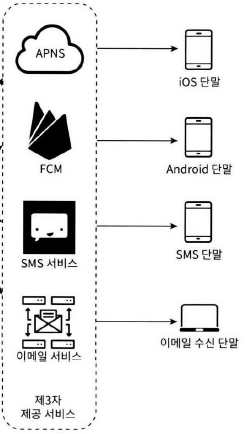
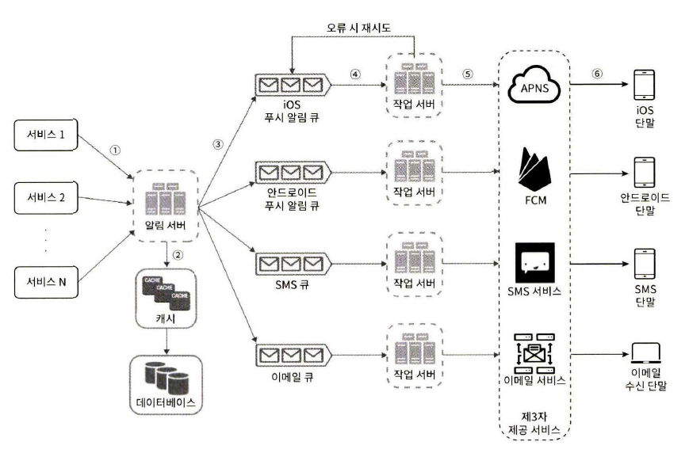
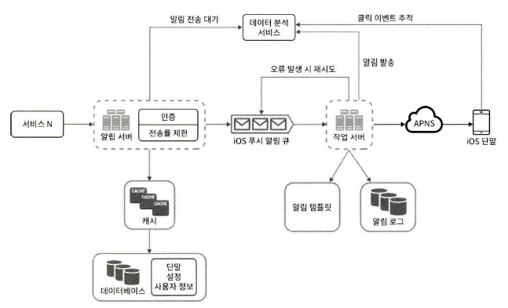

# 10. 알림 시스템 설계

 

# 알림 시스템이란 ?

- 알림 시스템은 최신 뉴스, 신상품, 이벤트, 선물 등 중요한 정보를 비동기적으로 고객에게 제공합니다.
- 알림 시스템은 모바일 푸시, SMS 메시지, 이메일의 3가지로 분류할 수 있습니다.
- 알림 시스템 설계 면접은 정답이 없고 문제 자체가 모호하게 주어지므로 적절한 질문으로 요구사항을 구체화시켜야 합니다.

  

# 1단계 : 문제 이해 및 설계 범위 확정

- **질문 :** 이 시스템은 어떤 종류의 알림을 지원해야 하나요 ? ( **답 :** 푸시 알림, SMS 메시지, 메일 3가지입니다. )
- **질문 :** 실시간 시스템 이어야 하나요? ( **답 :** 알림은 가능한 빨리, 부하가 높으면 약간의 지연은 허용됩니다. )
- **질문 :** 어떤 종류의 단말을 지원해야 하나요 ? ( **답 :** iOS, android, 랩톱/데스크톱 지원입니다. )
- **질문 :** 사용자에게 보낼 알림은 누가 만들 수 있나요 ? ( **답 :** 클라이언트와, 혹은 서버에서 스케줄링도 가능합니다. )
- **질문 :** 사용자가 알림을 받지 않도록 설정할 수도 있어야 하나요 ? ( **답 :** 네 )
- **질문 :** 하루에 몇 건의 알림을 보낼 수 있어야 하나요 ? ( **답 :** 천만 건의 모바일 푸시, 백만 건의 SMS, 오백만 건의 이메일을 보낼 수 있어야 합니다. )

  

# 2단계 : 개략적 설계안 제시 및 동의 구하기

 

## (1) 알림 유형별 지원 방안

- **iOS 푸시 알림**
  - **순서 :** 알림 제공자 → APNS → iOS 단말
  - **알림 제공자 :** 알림 요청을 만들어 애플 푸시 알림 서비스(APNS apple push notification service)로 보내는 주체입니다. 알림 요청을 만들려면 단말 토큰과 페이로드가 필요합니다.
    - **단말 토큰 :** 알림 요청을 보내는 데 필요한 고유 식별자
    - **페이로드 :** 알림 내용을 담은 JSON 딕셔너리
  - **APNS :** 애플이 제공하는 원격 서비스입니다. 푸시 알림을 iOS 장치로 보내는 역할을 합니다.
- **안드로이드 푸시 알림**
  - **순서 :** 알림 제공자 → FCM → 안드로이드 단말
- **SMS 메시지**
  - **순서 :** 알림 제공자 → SMS 서비스(제3 사업자의 서비스) → SMS 수신 단말
- **이메일**
  - **순서 :** 알림 제공자 → 이메일 서비스 → 이메일 수신 단말

 

## (2) 연락처 정보 수집 절차

- 사용자가 우리 앱을 설치하거나 처음 계정 등록 시 API 서버는 사용자의 정보를 수집해 데이터베이스에 저장합니다.
- 연락처 정보를 담을 테이블은, 기본적인 정보는 USER 테이블에 저장하고, 단말 토큰은 Device 테이블에 저장합니다. 한 사용자가 여러 단말을 가질 수 있기 때문에 device 테이블에 user_id를 담아 놓습니다.

 

## (3) 알림 전송 및 수신 절차

 

### 단일 서버 문제점

- 위 사진에서 만약 알림 서버 하나가 모든 서비스로부터 제3자 제공 서비스에 응답을 하는 방식이라면 생기는 문제점을 알아봅니다.
  - **SPOF( Single Point Of Failure ) :** 알림 서버가 하나밖에 없다는 것은, 그 서버에 장애가 생기면 전체 서비스의 장애로 이어짐을 의미합니다.
  - **규모 확장성 :** 한 대 서비스로 푸시 알림에 관계된 모든 것을 처리하므로, 데이터베이스나 캐시 등 중요 컴포넌트의 규모를 개별적으로 늘릴 방법이 없습니다.
  - **성능 병목 :** 알림을 처리하고 보내는 것은 자원을 많이 필요로 하는 작업이므로 트래픽이 몰릴 경우 시스템 과부하에 빠질 수 있습니다.

 

### 다중 서버로 해결

- 위 와 같은 문제점 때문에 알림 서버를 여러 개로 두고, 각 서버마다 캐시와 데이터베이스를 따로 두는 방식을 취합니다.
- **위 사진 설명**
  - **1~N까지의 서비스 :** 알림 서버의 API를 통해 알림을 보낼 서비스들입니다.
  - **알림 서버**
    - **알림 전송 API :** 스팸 방지를 위해 보통 사내 서비스 또는 인증된 클라이언트만 이용 가능합니다.
    - **알림 검증 :** 이메일 주소, 전화번호 등에 대한 기본적 검증을 수행합니다.
    - **데이터베이스 or 캐시 질의 :** 사용자 정보, 단말 토큰, 알림 설정 같은 메타데이터를 질의하여 가져옵니다.
    - **알림 전송 :** 알림 서버는 전송할 알림에 맞는 이벤트를 만들어 해당 이벤트를 위한 큐에 넣습니다. 본 설계안의 경우 하나 이상의 메시지 큐를 사용하므로 알림을 병렬적으로 처리할 수 있습니다.
  - **캐시 :** 사용자 정보, 단말 정보, 알림 템플릿 등을 캐시 합니다.
  - **데이터베이스 :** 사용자, 알림, 설정 등 정보를 저장합니다.
  - **메시지 큐 :** 시스템 컴포넌트 간 의존성을 제거하기 위해 사용합니다. 다량의 알림 전송 시 버퍼 역할도 합니다. 알림 종류별 큐를 두면 제3자 서비스 가운데 하나가 장애가 발생하더라도 다른 종류의 알림은 정상 작동하게 됩니다.
  - **작업 서버 :** 메시지 큐에서 전송할 알림을 꺼내 제3자 서비스로 전달하는 역할을 합니다.

  

# 3단계 : 상세 설계

 

## 안정성

- **데이터 손실 방지**
  - 알림 시스템은 알림 데이터를 반드시 데이터베이스에 보관하고 재시도 메커니즘을 구현해 알림 데이터 손실을 방지해야 합니다. 그러기 위해서 작업 서버는, 메시지 큐에서 데이터를 꺼내 알림 로그 데이터베이스에 저장해 놓아야 합니다.
- **알림 중복 전송 방지**
  - 같은 알림을 보내지 않도록 완전히 막는 것은 불가능합니다. 그러나 빈도를 줄이기 위해 중복 탐지 메커니즘을 도입해야 합니다. 예를 들어, 보내야 할 알림이 도착하면 그 이벤트 ID를 검사하여 이전에 있던 ID면 버리게 합니다.

 

## 추가로 필요한 컴포넌트 및 고려 사항

- **알림 템플릿**
  - 회사에서 고객에게 알림을 보낼 때 제목부터 내용까지 일일이 쓰지 않고 시간을 단축시키기 위해 알림 템플릿을 만들어 사용할 수 있습니다.
- **알림 설정**
  - 사용자는 알림을 받을지 유무를 선택할 수 있습니다. 해당 정보는 테이블을 만들어 보관하고, 알림 발송전 확인합니다.
- **전송률 제한**
  - 한 사용자가 알림을 받을 수 있는 빈도를 제한해야 합니다.
- **재시도 방법**
  - 제3자 서비스가 알림 전송에 실패하면, 해당 알림을 재시도용 큐에 넣습니다. 같은 문제 계속 발생 시 개발자에게 통지하게 합니다.
- **푸시 알림과 보안**
  - 인증, 승인된 사용자만 API를 통해 알림을 보낼 수 있게 합니다.
- **큐 모니터링**
  - 큐에 쌓인 알림의 개수를 통해 작업 서버를 증설해야 하는지를 파악할 수 있습니다.
- **이벤트 추적**
  - 알림 확인율, 클릭율, 실제 앱 사용으로 이어지는 비율 같은 매트릭은 비지니스 상 필수로 분석해야 하기 때문에 알림 시스템을 만들면 데이터 분석 서비스와도 통합해야 합니다.

