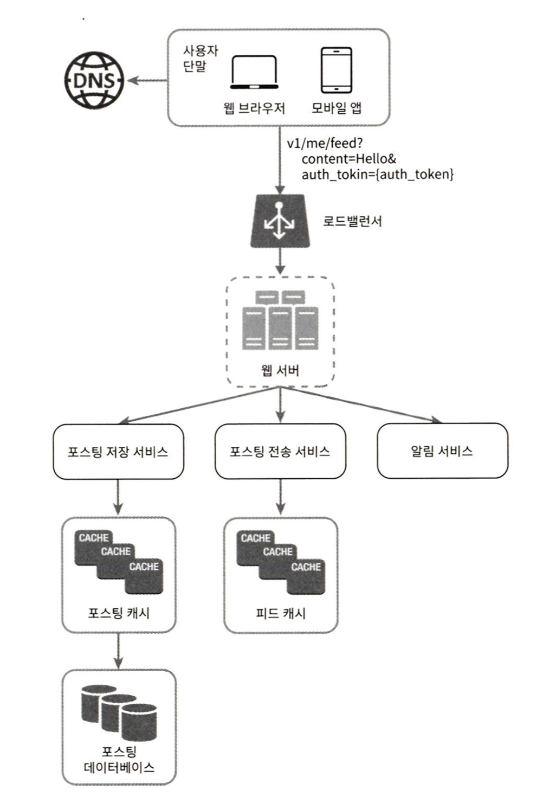
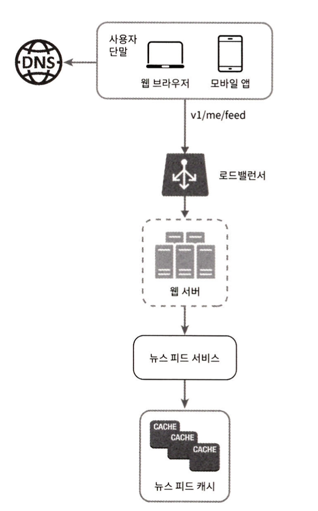
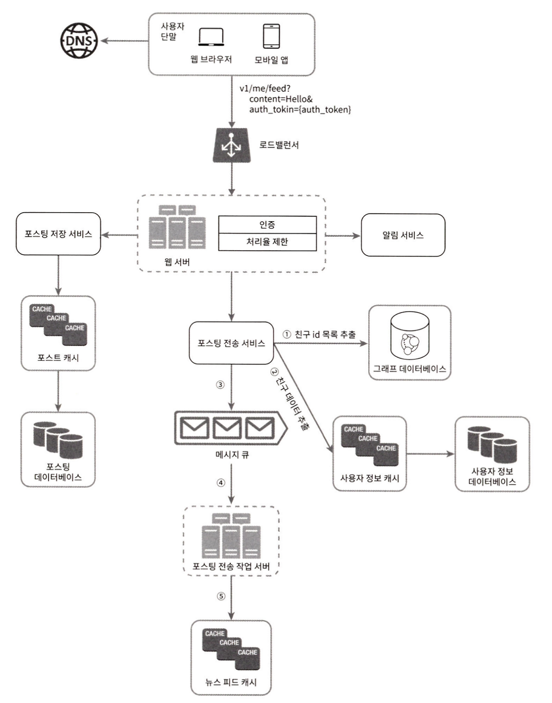
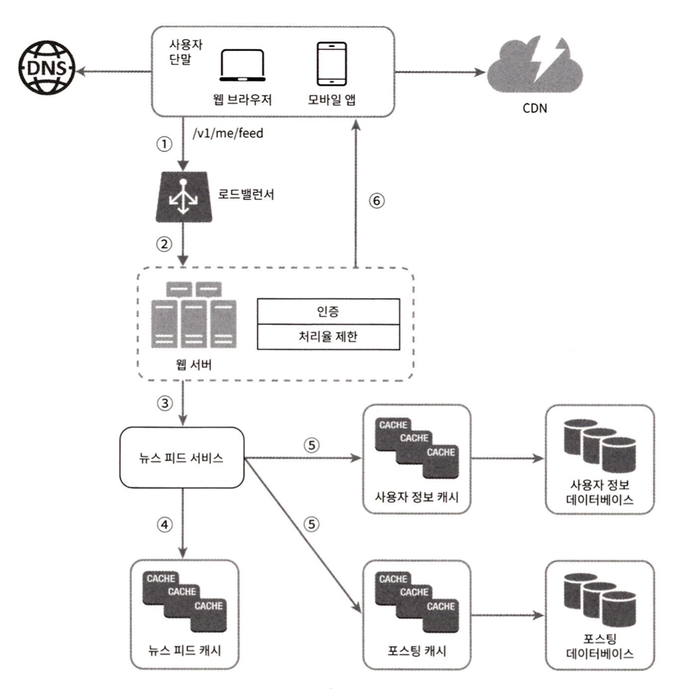
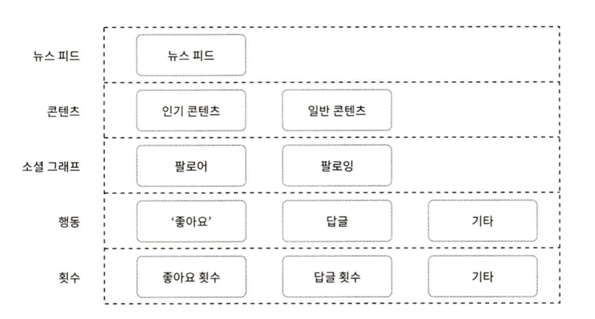

# 11. 뉴스 피드 시스템 설계

 

# 뉴스 피드란 ?

- 뉴스 피드는 우리 홈페이지 중앙에 지속적으로 업데이트되는 스토리들을 의미합니다.

  

# **1단계 : 문제 이해 및 설계 범위 확정**

- **질문 :** 모바일 앱, 웹 둘 다 지원해야 하나요 ?
  - **답 :** 네
- **질문 :** 중요한 기능으로는 어떤 것이 있을까요 ?
  - **답 :** 이용자가 뉴스피드 페이지에 새로운 스토리를 올릴 수 있어야 하고, 친구들이 올리는 스토리를 볼 수도 있어야 합니다.
- **질문 :** 뉴스 피드에 어떤 순서로 스토리가 표시되어야 하나요 ? 최신 포스트가 위에 와야 하나요 아니면 토픽 점수 같은 다른 기준이 있나요 ? 예를 들어, 가까운 친구의 포스트는 좀 더 위에 배치되어야 하나요 ?
  - **답 :** 단순히 시간 흐름 역순으로 표시된다고 가정합시다.
- **질문 :** 한 명의 사용자는 최대 몇 명의 친구를 가지나요 ?
  - **답 :** 5,000명입니다.
- **질문 :** 트래픽 규모는 어느 정도인가요 ?
  - **답 :** 매일 천만 명이 방문합니다( DAU 10millioin )
- **질문 :** 피드에 이미지나 비디오 스토리도 올릴 수 있나요 ?
  - **답 :** 네 가능합니다.

  

# **2단계 : 개략적 설계안 제시 및 동의 구하기**

 

## 설계 분류

- **피드 발행 :** 사용자가 스토리를 포스팅하면 해당 데이터를 캐시와 데이터베이스에 기록하며 새 포스팅은 친구의 뉴스 피드에도 전송됩니다.
- **뉴스 피드 생성 :** 지면 관계상 뉴스 피드는 모든 친구의 포스팅을 시간 흐름 역순으로 모아 만드는 것으로 가정합니다.

 

## 뉴스 피드 API

- 뉴스 피드 API는 클라이언트가 서버와 통신하기 위해 사용하는 HTTP 프로토콜 기반 수단입니다. 상태 정보 업데이트나, 친구 추가, 피드 가져오기 등을 수행합니다. 피드 발행 API와 피드 읽기 API가 있습니다.

 

### (1) 피드 발행 API

- **사용자 :** 모바일 앱, 웹에서 새 포스팅을 올리는 주체로 POST/v1/me/feed API를 사용합니다.
- **로드밸런서 :** 트래픽을 웹 서버들로 분산합니다.
- **웹 서버 :** HTTP 요청을 내부 서비스로 중계하는 역할을 담당합니다.
- **포스팅 저장 서비스 :** 새 포스팅을 DB와 Cache에 저장합니다.
- **포스팅 전송 서비스 :** 새 포스팅을 친구의 뉴스 피드에 푸시 합니다. 뉴스 피드 데이터는 캐시에 보관해 빠르게 읽을 수 있게 합니다.
- **알림 서비스 :** 친구들에게 새 포스팅이 올라왔음을 알리거나, 푸시 알림을 보내는 역할을 합니다.

 

### (2) 피드 읽기 API

- **사용자 :** 뉴스 피드를 읽는 주체로 GET/v1/me/feed API 사용합니다.
- **뉴스 피드 서비스 :** 캐시에 뉴스 피드를 가져오는 서비스입니다.
- **뉴스 피드 캐시 :** 뉴스 피드를 랜더링 할 때 필요한 피드 ID를 보관합니다.

  

# 3단계 : 상세 설계

 

## (1) 피드 발행 상세 설계

 

### 웹서버

- 클라이언트와 통신할 뿐 아니라 인증이나 처리율 제한 등의 기능도 수행합니다. 올바른 인증 토큰을 Authorization 헤더에 넣고 API를 호출하는 사용자만 포스팅할 수 있어야 합니다. 스팸 등을 막기 위해 특정 기간 동안 한 사용자가 올릴 수 있는 포스팅의 수에 제한을 두어야 합니다.

 

### 포스팅 전송(팬아웃) 서비스

- 포스팅 전송, 즉 팬아웃은 새 포스팅을 그 사용자와 친구 관계에 있는 모든 사용자에게 전달하는 과정입니다. 팬아웃은 두 가지 모델이 있습니다. 하나는 쓰기 시점에 팬아웃하는 모델, 하나는 읽기 시점에 팬아웃하는 모델입니다. **뉴스 피드를 빠르게 가져오는 것은 중요하므로 대부분의 사용자에 대해서는 푸시 모델을 사용합니다. 친구나 팔로어가 아주 많은 사용자의 경우 풀 모델을 사용합니다.**
  - **쓰기 시점 팬아웃 모델(push 모델) :** 새 포스팅 기록 시점에 뉴스 피드를 갱신, 즉, 포스팅 완료 시 바로 해당 사용자의 캐시에 해당 포스팅을 기록하는 것입니다.
    - **장점 :** 뉴스 피드가 실시간으로 갱신되며 친구 목록에 있는 사용자에게 즉시 전송됩니다. 새 포스팅이 기록되는 순간에 뉴스 피드가 이미 갱신되어 피드를 읽는 데 드는 시간이 짧습니다.
    - **단점 :** 친구가 많은 사용자의 경우 뉴스 피드 갱신 시간이 오래 걸립니다. 서비스 미이용 사용자까지 갱신하므로 컴퓨팅 자원이 낭비됩니다.
  - **읽기 시점에 팬아웃 하는 모델(pull 모델) :** 사용자가 본인 홈페이지나, 타임라인을 로딩하는 시점에 즉, 피드를 읽어야 하는 시점에 뉴스 피드를 갱신하는 요청 기반 모델입니다.
    - **장점 :** 미이용 사용자는 로그인하기까지 어떤 컴퓨팅 자원도 소모하지 않습니다, 데이터를 모든 친구에게 각각 푸시 하는 작업이 없어 핫키 문제가 없습니다.
    - **단점 :** 뉴스 피드를 읽는 데 많은 시간이 소요될 수 있습니다.

 

### 포스팅 전송 작업 서버

- 포스팅 전송 작업 서버가 메시지 큐에서 데이터를 꺼내 뉴스 피드 데이터를 뉴스 피드 캐시에 넣습니다.
- 뉴스 피드 캐시는 < 포스팅 ID, 사용자 ID >의 순서쌍을 보관하는 매핑 테이블이라고 볼 수 있습니다. 사용자 정보와 포스팅 정보 전부를 이 테이블에 저장하지 않는 이유는, 메모리 요구량이 커지기 때문입니다. 따라서 ID만 보관합니다.

 

## (2) 피드 읽기 흐름 상세 설계

④ : 뉴스 피드 서비스는 뉴스 피드 캐시에서 포스팅 ID 목록을 가져옵니다.

⑤ : 뉴스 피드에 표실 할 사용자 이름, 사용자 사진, 포스팅 콘텐츠, 이미지 등을 사용자 캐시와 포스팅 캐시에서 가져와 완전한 뉴스 피드를 만듭니다.
⑥ : 생성된 뉴스 피드를 JSON 형태로 클라이언트에게 보냅니다. 클라이언트는 해당 피드를 랜더링 합니다.

 

### 캐시 구조

- **뉴스 피드 :** 뉴스 피드의 ID를 보관합니다.
- **콘텐츠 :** 포스팅 데이터를 보관합니다. 인기 콘텐츠는 따로 보관합니다.
- **소셜 그래프 :** 사용자 간 관계 정보를 보관합니다.
- **행동 :** 포스팅에 대한 사용자의 행위에 관한 정보를 보관합니다. 포스팅에 대한 ‘좋아요’, 답글 등등이 이에 해당합니다.
- **횟수 :** ‘종아요’횟수, 응답 수, 팔로어 수, 팔로잉 수 등의 정보를 보관합니다.

  

# 4단계 마무리

회사마다 제약이나 요구 조건이 있어 시스템 설계 시 그 부분을 잘 고려해야 합니다. 설계를 진행하고 기술을 선택할 때는 그 배경에 어떤 타협적 결정들(trade-off)가 있었는지를 잘 이해하고 설명할 수 있어야 합니다. 시간이 남으면 면접관과 규모 확장성 이슈를 논의하는 것도 좋습니다.

- **DB 규모 확장**
  - 수직적 규모 확장 vs 수평적 규모 확장 / SQL vs NoSQL / Master-Slave 다중화 / 복제본에 대한 읽기 연산 / 일관성 모델 / DB 샤딩
- **이외 규모 확장**
  - 웹 계층을 무상태로 운영하기 / 가능한 한 많은 데이터를 캐시 할 방법 / 여러 데이터 센터 지원 방법 / 메시지 큐를 사용해 컴포넌트 사이 결합도 낮추기 / 핵심 메트릭에 대한 모니터링으로 트래픽이 몰리는 시간 대의 QPS(Queries per Second) 개선 / 사용자가 뉴스 피드를 새로고침 시 지연 시간 개선
