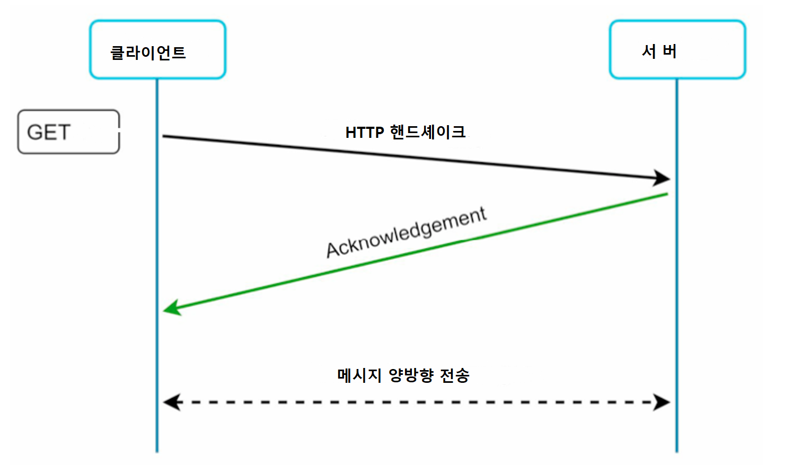
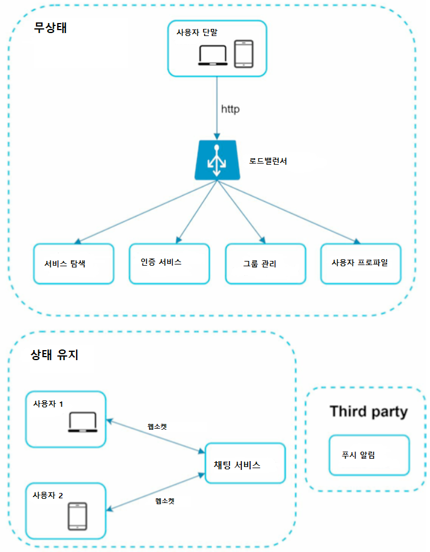
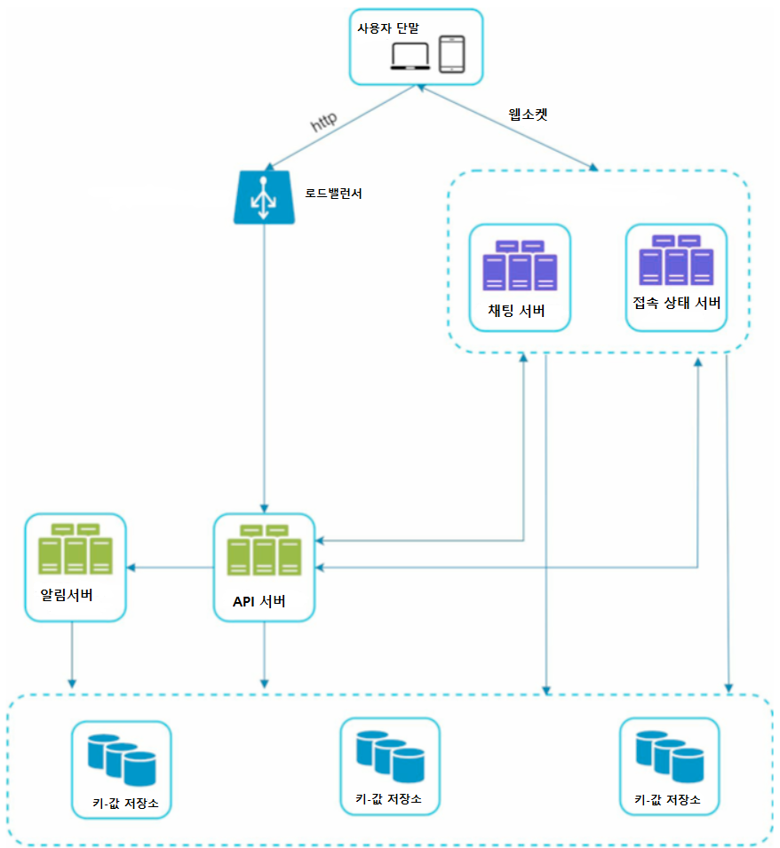
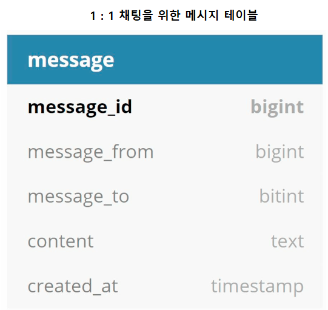
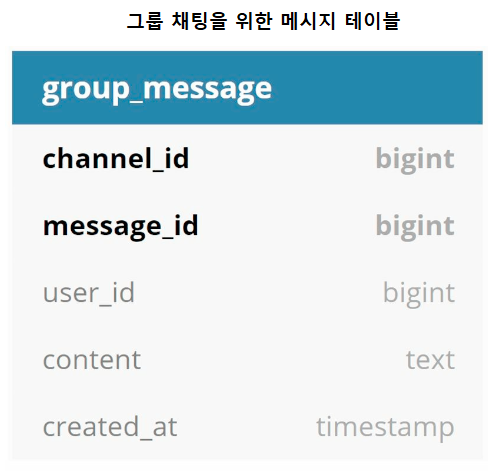
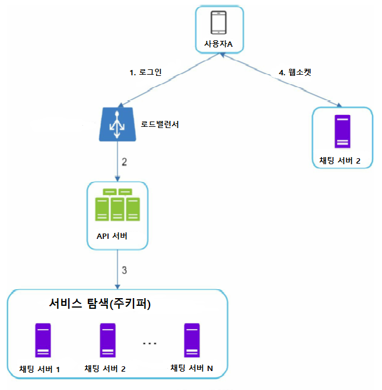
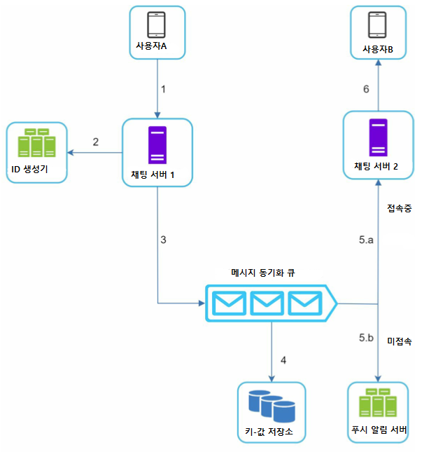
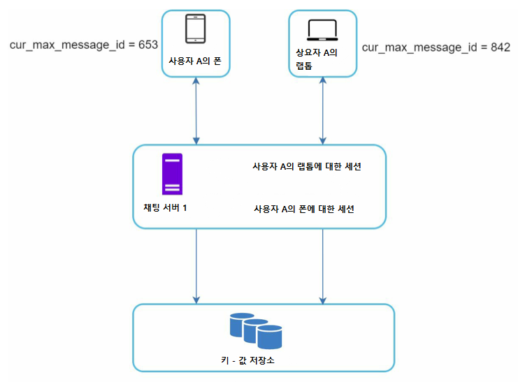
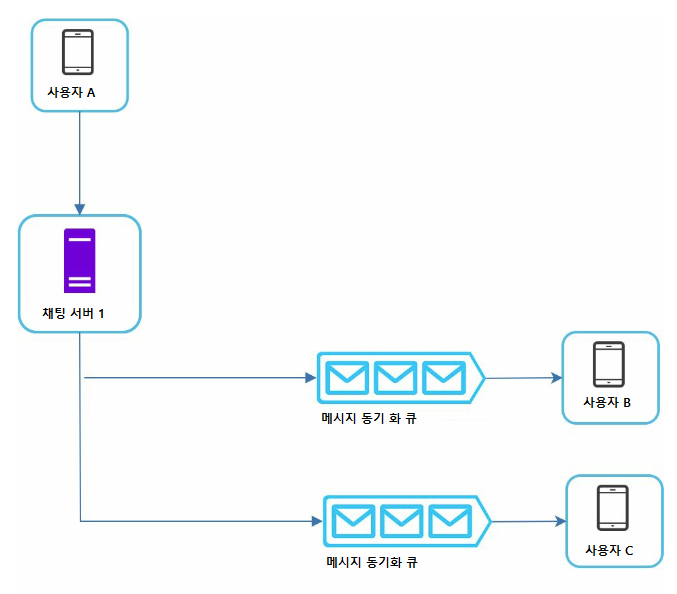
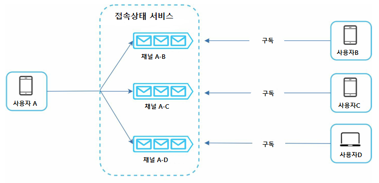

# 12. 채팅 시스템 설계

  

# 1단계 : 문제 이해 및 설계 범위 확정

설계 시 어떤 채팅 앱 설계인지 확실히 해 두는 것이 면접에서 가장 중요합니다. 1:1 채팅에 중점인지, 슬랙 같은 그룹 채팅에 중점을 둔 업무용 앱이나, 디스코드 같이 대규모 그룹의 소통과 응답 지연이 낮은 음성 채팅에 집중하는 앱도 있습니다.

- **질문 :** 1 : 1채팅 앱입니까 그룹 채팅 앱입니까?
  - **답 :** 둘 다입니다.
- **질문 :** 모바일, 웹 어떤 건가요?
  - **답 :** 둘 다입니다.
- **질문 :** 처리 트래픽 규모는 어느 정도인가요?
  - **답 :** 일별 능동 사용자(DAU : Daily Active User) 기준 5천만 명입니다.
- **질문 :** 그룹 채팅의 경우 인원 제한이 있나요 ?
  - **답 :** 최대 100명입니다.
- **질문 :** 중요 기능은 어떤 건가요? 파일 첨부가 가능한가요 ?
  - **답 :** 1:1 채팅, 그룹 채팅, 사용자 접속 상태 표시 지원해야 합니다. 텍스트만 주고받습니다.
- **질문 :** 메시지 길이에 제한이 있나요 ?
  - **답 :** 네 십만 자 이하입니다.
- **질문 :** 종단 간 암호화를 지원해야 하나요 ?
  - **답 :** 필요 없지만 논의는 가능합니다.
- **질문 :** 채팅 이력은 얼마나 오래 보관해야 할까요 ?
  - **답 :** 영원히입니다.

  

# 2단계 : 개략적 설계안 제시 및 동의 구하기

- 응답 지연이 낮은 1:1 채팅 기능 + 최대 100명까지 참여하는 그룹 채팅 기능 + 사용자 접속 상태 표시기능 + 다양한 단말 지원 + 하나의 계정으로 여러 단말 동시 접속 지원 + 푸시 알림 + 5천만 DAU를 처리하게 구현합니다.
- 채팅 구현 시 어떤 프로토콜을 쓸지도 중요합니다.

 

## 서버가 연결을 만드는 것처럼 동작하는 기법

- **폴링(Polling), 롱 폴링(long Polling), 웹소켓(WebSocket) 등 기술이 있습니다.**
- **폴링**
  - 클라이언트가 주기적으로 서버에게 새 메시지가 있는지 물어보는 방법입니다. 폴링을 자주 사용할수록 폴링 비용이 올라간다. 답해줄 메시지가 없으면 불필요한 서버 자원이 낭비되는 문제가 있습니다.
- **롱 폴링**
  - 폴링의 비효율성을 개선한 기법이 롱 폴링입니다. 클라이언트는 질문을 보내고 새 메시지가 반환되거나 타임 아웃 될 때까지 연결을 유지합니다. 서버는 메시지가 없으면 대기하다가 있으면 보냅니다. 타임 아웃이 되면 연결은 끊기고 다시 클라이언트가 서버로 롱 폴링을 보냅니다.
    - **단점 :** 다중 서버인 경우, 로드밸런싱에 의해 사용자의 요청이 여러 서버에 나눠져 가기 때문에 메시지를 받은 서버가 해당 메시지를 수신할 클라이언트와의 롱 폴링 연결을 갖고 있지 않을 수 있습니다. 또, 서버 입장에서 클라이언트가 연결을 해제했는지 알 수 없습니다. 이 방법도 어쨌든 비효율적입니다. 클라이언트가 타임아웃되면 다시 요청을 보내기 때문입니다.
- **웹소켓**

  - 웹소켓은 서버가 클라이언트에게 비동기 메시지를 보낼 때 가장 널리 사용하는 기술입니다.

  

  - 웹소켓 연결은 클라이언트가 시작하며 한번 맺어진 연결은 영구적이며 양방향입니다. 처음에는 HTTP 연결이지만 특정 핸드 셰이크 절차를 거쳐 웹소켓 연결로 업그레이드됩니다. 이 영구적 연결이 만들어진 후 서버는 클라이언트에게 비동기적으로 메시지를 전송할 수 있습니다. 웹소켓은 80, 443 포트를 쓰기 때문에 방화벽 환경에서도 잘 작동합니다.
  - 웹소켓 구현 시 주의할 점은 웹소켓 연결이 영구적이어야 하기 때문에 서버 측에서 연결 관리를 효율적으로 해야 한다는 것입니다.

 

## 개략적 설계안

- 채팅 시스템은 세 부분으로 나눠 볼 수 있습니다.
  - 무상태 서비스 + 상태 유지 서비스 + 제3자 서비스 연동

- **무상태 서비스**
  - 로그인, 회원가입, 사용자 프로파일 표시 등을 처리하는 전통적인 요청/응답 서비스입니다. 무상태 서비스는 로드밸런서 뒤에 위치합니다.
- **상태 유지 서비스**
  - 이 설계에서 유일하게 상태 유지가 필요한 서비스는 채팅 서비스입니다. 클라이언트는 보통 서버가 살아 있는 한 다른 서버로 연결을 변경하지 않습니다. 서비스 탐색 서비스는 채팅 서비스와 협력해 특정 서버에 부하가 몰리지 않도록 합니다.
- **제3자 서비스 연동(Third Party)**
  - 채팅 앱에서 가장 중요한 제3자 서비스는 푸시 알림입니다. 새 메시지를 받았다면 설사 앱이 실행 중이지 않더라도 알림을 받아야 합니다.

- **개략적 설계안**
  - 채팅 서버는 클라이언트 사이에 메시지를 중계하는 역할을 담당합니다.
  - 접속 상태 서버는 사용자의 접속 여부를 관리합니다.
  - API 서버는 로그인, 회원가입, 프로파일 변경 등 그 외 나머지 전부를 처리합니다.
  - 알림 서버는 푸시 알림을 보냅니다.
  - 키-값 저장소는 채팅 이력을 보관합니다. 시스템에 접속한 사용자는 이전 채팅을 다 볼 수 있습니다.
- **저장소**

  - 관계형 DB를 쓸지 NoSQL을 쓸지 판단하기 위해 데이터의 유형과 읽기/쓰기 연산의 패턴을 봐야 합니다. 채팅 시스템이 다루는 데이터에 따라 저장을 달리합니다.

    - **관계형 DB :** 사용자 프로파일, 설정, 친구 목록처럼 일반적인 데이터를 저장합니다. 다중화와 샤딩은 이런 데이터의 가용성과 규모 확장성을 보증하기 위해 보편적으로 사용되는 기술입니다.
    - **NoSQL :** 채팅 시스템의 고유 데이터로, 채팅 이력입니다. 사용자가 빈번하게 조회하는 것은 최근에 주고받은 메시지입니다. 그러나 검색이나, 특정 메시지로 점프해 무작위적인 데이터 접근도 지원해야 합니다. 채팅 앱의 경우 읽기 쓰기 비율은 대략 1:1입니다.

      - **장점 :** 키-값 저장소는 수평적 규모 확장이 쉽고 데이터 접근 지연시간이 낮습니다.( 페북은 HBase, Discord는 카산드라 사용 )

        

        - 이 테이블의 기본 키는 message_id로, 메시지 순서를 쉽게 정할 수 있도록 하는 역할을 합니다.

          

        - channel_id, message_id의 복합키를 기본 키로 사용합니다. 여기서 채널은 채팅 그룹과 같은 뜻입니다. channel_id는 파티션 키로도 사용합니다.

  - **메시지 ID**
    - 메시지 ID는 메시지들의 순서도 표현할 수 있어야 합니다. 이를 위해 메시지 ID는 고유해야 하며, ID 값은 정렬 가능하고 시간 순서와 일치해야 합니다. 즉 새로운 ID는 이전 ID보다 큰 값이어야 합니다.
    - NoSQL에서는 auto_increment 지원이 불가하여 스노플레이크 같은 전역적 64-bit 순서 번호 생성기를 사용합니다. 또한 지역적 순서 번호 생성기를 이용하는 방법도 있습니다. 지역적이라 함은, ID의 유일성이 같은 그룹 안에서만 다르면 충분하다는 것입니다.

  

# 3단계 : 상세 설계

 

## 서비스 탐색

- 서비스 탐색 기능의 주된 역할은 클라이언트에게 가장 적합한 채팅 서버를 추천하는 것입니다. 이때 사용되는 기준은 클라이언트의 위치, 서버 용량 등이 있습니다. 서비스 탐색 기능 구현 시 아파치 주키퍼 같은 오픈 소스를 사용합니다.

- **작동 방식 :** 로그인 요청 **→** 로드밸런서가 로그인 요청을 API 서버들 가운데로 보냄 → API 서버가 인증 후 서비스 탐색 기능이 동작해 사용자를 서비스할 최적의 채팅 서버를 찾음(위 그림은 채팅 서버 2가 반환된 것을 그린 것) → 사용자는 해당 채팅 서버와 웹소켓 연결을 맺음

 

## 메시지 흐름

**1 : 1 채팅에서 사용자의 메시지 경로 처리**

- **1 )** 사용자 A가 채팅 서버 1로 메시지 전송
- **2 )** 채팅 서버 1은 ID 생성기를 사용해 해당 메시지의 ID 결정
- **3 )** 채팅 서버 1은 사용자의 메시지를 메시지 동기화 큐로 전송
- **4 )** 메시지가 키-값 저장소에 보관됨
- **5.a )** 사용자 B가 접속 중인 경우 메시지는 사용자 B가 접속 중인 채팅 서버로 전송됨
- **5.b )** 사용자 B가 접속 중이 아니면 푸시 알림 메시지를 푸시 알림 서버로 보냄
- **6 )** 채팅 서버 2는 사용자 B와 웹소켓 연결이 있는 상태이므로 서버가 사용자 B에게 메시지 전송이 가능합니다.

**여러 단말 사이의 메시지 동기화**

- 각 단말은 cur_max_message_id라는 변수를 유지하는데, 해당 단말에서 관측된 가장 최신 메시지 번호를 의미합니다.
- **흐름**
  - **1 )** 클라이언트가 서버에 cur_max_message_id를 실어 보내며 “나보다 큰 새 메시지 있으면 줘”라고 요청
  - **2 )** 채팅 서버는 이때 로그인한 사용자 ID가 수신자 ID와 같고, 키-값 저장소에 보관된 메시지에서 메시지 ID가 단말이 보내온 cur_max_message_id보다 큰 메시지들을 찾아서 사용자에게 보냄
  - **3 )** 그 후 단말은 수신한 메시지 중 가장 큰 message_id로 cur_max_message_id를 갱신
  - **4 )** 위 과정 반복

**소규모 그룹 채팅에서의 메시지 흐름**

- 단체 채팅에 3명이 있다고 가정한 그림입니다. 사용자 A가 보낸 메시지는 B,C 사용자의 메시지 동기화 큐에 복사됩니다. 규모가 커지면 메시지 복사가 효율적이지 못할 수 있습니다.

**접속 상태 표시**

- 접속 상태 표시를 위해 접속 상태 서버를 통해 사용자의 상태를 관리합니다. 사용자의 상태가 바뀌는 시나리오는 아래와 같습니다.
- **사용자 로그인**
  - 사용자가 로그인하고 접속 상태 서버와 연결되면, 키-값 저장소에 status 값을 online으로 저장합니다.
- **로그아웃**
  - 사용자가 로그아웃하면 키-값 저장소에 status 값을 offline으로 변경합니다.
- **접속 장애**
  - 접속 장애 판단을 위해 박동 검사를 통해 해결합니다. 즉, 온라인 상태의 클라이언트로 하여금 주기적으로 박동 이벤트를 접속 상태 서버로 보내도록 하고, 마지막 이벤트를 받은 지 x 초 이내에 또 다른 박동 이벤트 메시지를 받으면 해당 사용자의 접속 상태를 계속 온라인으로 유지합니다.

**접속 상태 정보의 전송**

- 상태 정보 서버는 발행-구독 모델을 사용하는데, 즉 각각의 친구 관계마다 채널을 하나씩 두는 것입니다. 위 그림과 같이 사용자 A의 상태가 변경되면 그 사실을 연결된 채널들에 쓰는 것입니다. 이 방법은 사용자가 작을 때 효과적입니다.

  

# 4단계 : 마무리 ( 추가 논의 사항 )

 

- **채팅 앱 확장을 위해 사진, 비디오 등 미디어 지원 방법 토론**
  - 미디어 파일에 대해 압축 방식, 클라우드 저장소, 섬네일 생성 등 논의 가능
- **종단 간 암호화**
  - 왓츠앱은 메시지 전송에 있어 종단 간 암호화를 지원합니다. 메시지 발신, 수신자 외에는 메시지를 볼 수 없습니다.
- **캐시**
  - 클라이언트에 이미 읽은 메시지를 캐시 해 두면 서버 부하를 줄일 수 있습니다.
- **로딩 속도 개선**
  - 슬랙은 사용자의 데이터, 채널 등을 지역적으로 분산하는 네트워크를 구축하여 앱 로딩 속도를 개선했습니다.
- **채팅 서버 오류**
  - 서버 하나가 죽으면 서비스 탐색 기능(주키퍼 같은)이 작동해 클라이언트에게 새 서버를 배정하고 다시 접속할 수 있게 해야 합니다.
- **메시지 재전송**
  - 재시도나 큐는 메시지의 안정적 전송을 보장하기 위해 흔히 사용되는 기법입니다.
