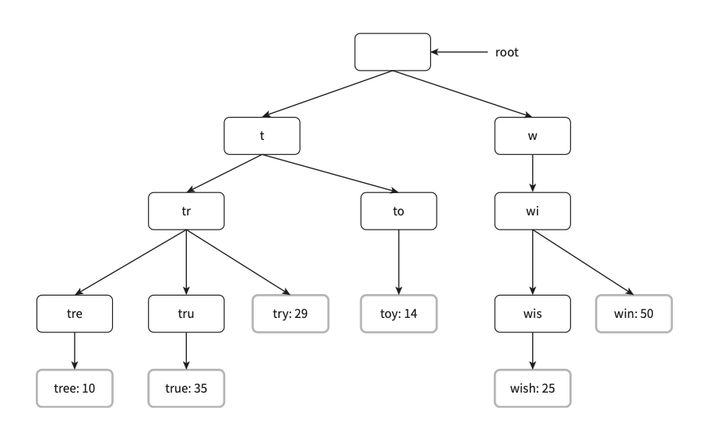

# 13. 검색어 자동완성 시스템

- 가장 많이 이용된 검색어 K 개를 자동완성하여 출력하는 시스템을 설계합니다.

  

# 1단계 : 문제 이해 및 설계 범위 확정

- **질문 :** 사용자가 입력한 단어는 자동완성될 단어의 첫 부분인가요 아니면 중간 부분이 될 수 있습니까 ?
  - **답 :** 첫 부분으로 한정하겠습니다.
- **질문 :** 몇 개의 자동완성 검색어가 표시되어야 합니까 ?
  - **답 :** 5개입니다.
- **질문 :** 자동완성 검색어 5개를 고르는 기준은 무엇입니까 ?
  - **답 :** 질의 빈도에 따라 정해지는 검색어 인기 순위를 기준으로 합니다.
- **질문 :** 맞춤법 검사 기능도 제공해야 합니까 ?
  - **답 :** 맞춤법이나 자동 수정 기능은 없습니다.
- **질문 :** 질의는 영어인가요?
  - **답 :** 네 시간이 허락하면 다국어 지원을 생각해도 좋습니다.
- **질문 :** 대문자나 특수 문자 처리도 해야하나요 ?
  - **답 :** 아뇨 소문자로 한정합니다.
- **질문 :** 얼마나 많은 사용자를 지원해야 하죠?
  - **답 :** 일간 능동 사용자(DAU) 천만입니다.

 

### 개략적 규모 추정

- 일간 능동 사용자 천만 명으로 가정하며 한 사용자는 매일 10건 검색 수행을 가정합니다.
- 질의 시 평균적으로 20byte 데이터를 입력한다고 가정합니다 → 영어 1글자는 1byte이고, 질문은 평균 4단어로 각 단어 당 5글자를 가정하여 20byte 산출
- 검색 창에 글자를 입력할 때마다 클라이언트는 검색어 자동완성 서버에 요청을 보냅니다. 따라서 평균 1회 검색당 20건의 요청이 서버로 전달됩니다.
- **QPS ( Query Per Second ) :** 한질의는 서버에 20건의 요청을 보냄 → 인당 하루 10건의 질이면 서버에 인당 200건의 요청을 보냄 → 유저 천만 명이면 하루 2,000,000,000건 요청 → 20억 / 60 _ 60 _ 24 = 23,148
- **최대 QPS :** 23,148 \* 2 = 약 46,000
- **데이터 증가량 :** 일 질의의 20%는 신규 데이터로 저장된다 가정, 인당 일 200byte \* 20% = 40byte가 추가됨 → DAU 천만을 곱하면, 400,000,000 byte → 0.4GB

  

# 2단계 : 개략적 설계안 제시 및 동의 구하기

 

## 시스템 분류

- **데이터 수집 서비스 :** 사용자가 입력한 질의를 실시간으로 수집하는 시스템으로 빈도 테이블에 각 단어마다의 빈도를 증가시킵니다.
- **질의 서비스 :** 주어진 질의에 다섯 개의 인기 검색어를 정렬해 내놓는 서비스이며 각 단어마다 빈도수가 가장 높은 단어 TOP 5를 내놓습니다.
- **빈도 테이블 구상**
  | 질의 | 빈도 |
  | ------- | ---- |
  | twitch | 19 |
  | twitter | 5 |

  

# 3단계 : 상세 설계

 

## 트라이 자료구조

- 개략적 설계안에서는 단어를 관계형 데이터베이스에 저장했으나, 데이터가 많으면 비효율 적입니다. 그래서 문자열들을 간략하게 저장할 수 있는 트라이 자료구조를 통해 최적화합니다.
- **특징**
  - 트라이는 트리 형태의 자료구조이며, 루트는 빈 문자열을 나타냅니다.
  - 각 노드는 글자 하나를 저장하며 26개(알파벳 모두)의 자식 노드를 가질 수 있습니다.
  - 각 트리 노드는 하나의 단어, 또는 접두어 문자열을 나타냅니다.
- **트리 형태 이미지 (** 완성된 각 단어 옆에 빈도수를 같이 저장 )

- 위 트리 구조에서 가장 많이 사용된 질의 K는 아래와 같이 찾을 수 있습니다.
  - 해당 접두어를 표현하는 노드를 찾음 → 해당 노드부터 시작하는 하위 트리를 탐색해 모든 유효 노드를 찾음 → 유효 노드들을 정렬해 가장 인기 있는 검색어 K 개를 찾음
- 위와 같이 찾을 경우 최악의 경우 K 개의 결과를 위해 전체 트라이를 다 검색해야 할 수 있으므로 [접두어 최대 길이 제한] 및 [각 노드에 인기 검색어 캐시]로 효율성을 높입니다.
- **접두어 최대 길이 제한**
  - 사용자가 검색창에 긴 한 단어를 입력하는 일은 거의 없으므로 입력 가능한 단어 기를 50과 같은 숫자로 제한합니다.
- **노드에 인기 검색어 캐시**
  - 각 노드에 K 개의 인기 검색어를 미리 저장하면 전체 트라이를 검색하는 일을 방지할 수 있습니다. 저장 공간이 더 필요하지만 속도는 향상됩니다.
- 접두어 최대 길이를 제한하고, 노드에 인기 검색어를 캐시 하면 시간 복잡도는 O(1)

 

## 데이터 수집 서비스

- 사용자가 데이터 입력 시마다 트라이를 수정하는 건 효율적이지 못합니다. 그래서 데이터를 로그로 저장해 놓고, 특정 시간에 변경하는 방향으로 설계를 진행합니다. 아래는 데이터 수집 서비스의 수정된 설계안입니다.

- **데이터 분석 서비스 로그**
  - 데이터 분석 서비스 로그에는 검색창에 입력된 질의에 관한 원본 데이터가 보관됩니다.
- **로그 취합 서버**
  - 로그양이 많기 때문에 사용할 수 있게 가공해야 합니다. 데이터 가공은 서비스 특징에 따라 달라집니다.
- **작업 서버**
  - 작업 서버는 주기적으로 비동기 작업을 실행하는 서버 집합입니다. 트라이 자료구조를 만들고 트라이 데이터베이스에 저장하는 역할을 합니다. 갱신은 일주일에 한번 한다고 가정합니다.
- **트라이 캐시**
  - 분산 캐시 시스템으로 트라이 데이터를 메모리에 유지하여 읽기 연산 성능을 높이는 역할을 합니다. 매주 트라이 데이터베이스의 스냅샷을 떠서 갱신합니다.
- **트라이 데이터베이스**
  - **문서 저장소 :** 새 트라이를 매주 만듦으로 주기적으로 트라이를 직렬화하여 몽고디비 같은 문서 저장소를 활용해 저장합니다.
  - **키-값 저장소 :** 트라이에 보관된 모든 접두어를 해시 테이블 키로 변환하고, 각 트라이 노드에 보관된 모든 데이터를 해시 테이블 값으로 변환하여 저장할 수 있습니다.

 

## 질의 서비스

- **1 )** 검색 질의가 로드밸런서로 전달됩니다.
- **2 )** 로드밸런서가 질의를 API 서버로 보냅니다.
- **3 )** API 서버는 트라이 캐시에서 데이터를 가져와 해당 요청에 대한 자동완성 검색어 제안을 구성합니다.
- **4 )** 데이터가 트라이 캐시에 없는 경우 데이터를 데이터베이스에서 가져와 캐시에 채웁니다.
- **5 )** 성능 개선을 위해 검색어들을 브라우저 캐시에 일정 시간 캐싱 해 놓는 방법을 씁니다.

 

## 트라이 연산

- **트라이 생성 :** 생성은 작업 서버가 데이터 분석 서비스의 로그나 DB로부터 취합한 데이터를 사용합니다.
- **트라이 갱신 :** 매주 한 번 새로운 트라이를 만든 후 기존 트라이를 대체합니다.
- **검색어 삭제 :** 불건전한 검색어들은 노출되지 않도록, API 서버와 트라이 캐시 사이에 필터 계층을 두어 검색어를 필터링합니다. DB에서 삭제하는 것은 다음 업데이트 사이클에 비동기적으로 진행합니다.

 

## 저장소 규모 확장

- 트라이 크기가 한 서버에 들어가지 않을 정도일 경우를 대비해 규모 확장성 문제를 해결합니다.
- **샤딩**
  - 영어만 지원한다면 간단하게 첫 글자 기준으로 샤딩합니다. a ~ m 까지는 서버1에, n ~ z 까지는 서버 2에 저장합니다. 이 방법은 각 서버당 데이터가 고르게 분배되지 못할 수 있어 검색어 대응 샤드 관리자를 생성하여 사용하는 방법도 있습니다.
    
    

  

# 4단계 : 마무리 ( 추가 논의 사항 )

- **다국어 지원 시 시스템 확장하는 방법 :** 트라이에 유니코드 데이터를 저장하게 합니다.
- **국가별 인기 검색어 순위가 다르면 :** 국가별 다른 트라이를 사용하도록 하고 CDN에 저장해 속도를 높입니다.
- **실시간으로 변하는 검색어 추이 반영은 어떻게 하는가 :** 트라이 재생성은 리소스가 크므로 재생성 시 리소스를 줄이는 방향으로 진행합니다.
  - 샤딩을 통해 작업 대상 데이터를 줄이는 것
  - 순위 모델을 바꿔 최근 검색어에 보다 높은 가중치를 주는 것
