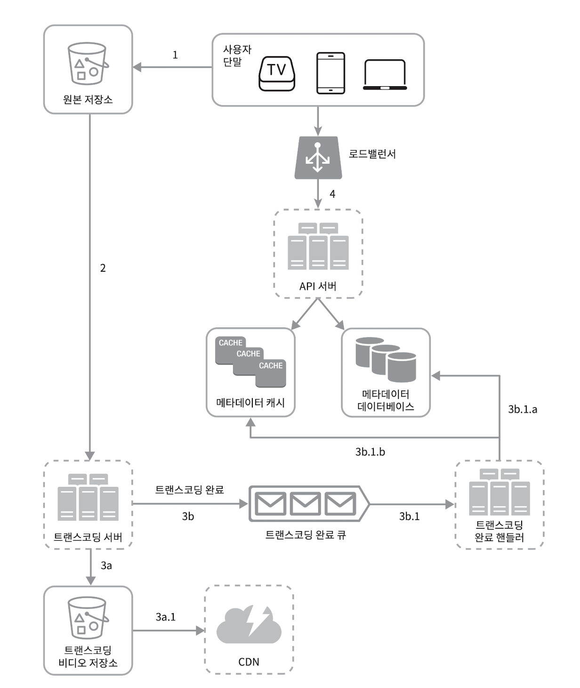

# 14. 유튜브 설계

  

# 1단계 : 문제 이해 및 설계 범위 확정

- **질문 :** 어떤 기능이 가장 중요한가요 ?
  - **답 :** 비디오를 올리는 것과 시청 기능입니다.
- **질문 :** 어떤 클라이언트를 지원해야 하나요 ?
  - **답 :** 앱, 웹, 스마트 TV입니다.
- **질문 :** 일간 능동 사용자 수는 몇 명인가요 ?
  - **답 :** 5백만입니다.
- **질문 :** 사용자 평균 사용 시간은 얼마인가요 ?
  - **답 :** 30분입니다.
- **질문 :** 다국어 지원이 필요한가요 ?
  - **답 :** 네 모든 언어로 이용합니다.
- **질문 :** 어떤 비디오 해상도를 지원하나요 ?
  - **답 :** 현존하는 비디오 대부분입니다.
- **질문 :** 암호화가 필요한가요 ?
  - **답 :** 네
- **질문 :** 비디오 파일 크기 제한이 있나요 ?
  - **답 :** 최대 1GB입니다.
- **질문 :** 아마존, 구글, MS가 제공하는 클라우드 서비스 활용이 가능한가요 ?
  - **답 :** 좋습니다.

 

## 개략적 규모 추정

- DAU 5백만, 한 사용자 하루에 평균 5개 비디오 시청 , 10%의 이용자가 하루 1비디오 업로드, 비디오 평균 크기는 300MB
- 일 추가 용량 : 50만 \* 300MB = 150TB
- CDN 비용 : 미국 기준 1GB당 0.02$ / 5백만 _ 5비디오 _ 0.3GB **\*0.02 = 15만 달러**

  

# 2단계 : 개략적 설계안 제시 및 동의 구하기

 

## 비디오 업로드 절차

- **API 서버 :** 비디오 스트리밍을 제외한 다른 모든 요청을 처리합니다.
- **메타데이터 데이터베이스 :** 비디오의 메타데이터를 보관합니다. 샤딩과 다중화를 적용해 성능 및 가용성 요구사항을 충족합니다.
- **메타데이터 캐시 :** 성능을 높이기 위해 비디오 메타데이터와 사용자 객체는 캐시 합니다.
- **원본 저장소 :** 원본 비디오를 보관할 대형 이진 파일 저장소 ( Binary Large Object Storage )
- **트랜스 코딩 서버 :** 비디오 트랜스 코딩은 비디오 인코딩이라 부르는 절차로, 비디오 포맷을 변환하는 절차입니다. 단말이나 대역폭 요구사항에 맞는 최적의 비디오 스트림을 제공하기 위해 필요합니다.
- **트랜스 코딩 비디오 저장소 :** 트랜스 코딩이 완료된 비디오를 저장하는 BLOB입니다.
- **CDN :** 비디오를 캐시 하는 역할을 담당합니다. 사용자가 재생 버튼 클릭 시 비디오 스트리밍은 CDN을 통해 이뤄집니다.
- **트랜스 코딩 완료 큐 :** 비디오 트랜스 코딩 완료 이벤트들을 보관할 메시지 큐
- **트랜스 코딩 완료 핸들러 :** 트랜스 코딩 완료 큐에서 이벤트 데이터를 꺼내어 메타데이터 캐시와 DB를 갱신할 작업 서버들

 

## 프로세스 a 비디오 업로드

- **1 )** 비디오를 원본 저장소에 업로드합니다.
- **2 )** 트랜스 코딩 서버는 원본 저장소에서 해당 비디오를 가져와 트랜스 코딩을 시작합니다.
- **3 )** 트랜스 코딩 완료 시 아래 절차가 병렬적으로 수행됨
  - **3a :** 완료된 비디오를 트랜스코딩 비디오 저장소로 업로드
  - **3b :** 트랜스 코딩 완료 이벤트를 트랜스 코딩 완료 큐에 넣습니다.
    - **3a.1 :** 트랜스 코딩이 끝난 비디오를 CDN에 올립니다.
    - **3b.1 :** 완료 핸들러가 이벤트 데이터를 큐에서 꺼냅니다.
    - **3b.1.a + 3b.1.b :** 완료 핸들러가 메타데이터 데이터베이스와 캐시를 갱신합니다.
- **4 )** API 서버가 단말에게 비디오 업로드가 끝나서 스트리밍 준비가 되었음을 알립니다.

 

## 프로세스 b 메타데이터 갱신

- 원본 저장소에 파일이 업로드되는 동안, 단말은 병렬적으로 비디오 메타데이터 갱신 요청을 API 서버에 보냅니다. 메타데이터에는 파일 이름, 크기, 포맷 등이 있습니다.

 

## 비디오 스트리밍 절차

- 비디오는 CDN에서 바로 스트리밍 됩니다. 이때 스트리밍 프로토콜( 비디오 스트리밍을 위해 데이터를 전송할 때 쓰이는 표준화된 통신방법이다 )을 사용합니다.

  

# 3단계 : 상세 설계

 

## 비디오 트랜스 코딩

- **비디오를 아래와 같은 이유로 여러 포맷으로 저장하는 것을 말합니다.**
  - 가공되지 않은 원본 비디오는 크기가 큽니다.
  - 단말과 브라우저에 따라 특정 종류의 비디오 포맷만 지원하므로 여러 포맷으로 인코딩이 필요합니다.
  - 사용자의 끊김 없는 시청을 보장하려면 사용자의 대역폭에 따라 고화질, 저화질을 자동으로 변경하거나 수동으로 변경하여 송신할 수 있어야 합니다.
- **인코딩 포맷**
  - **컨테이너 :** 비디오 파일의 메타데이터를 담는 바구니 역할. avi, mov, mp4 형태
  - **코덱 :** 비디오 화질은 보존하면서 파일 크기를 줄일 목적으로 고안된 압축 및 압축 해제 알고리즘입니다. ( H.264, VP9, HEVC 등.. )
- **유향 비순환 그래프(DAG) 모델**

  - 비디오 트랜스 코딩은 무거운 작업이기 때문에 아래와 같은 형태로 진행합니다.

    

  - **검사 :** 영상의 품질 파악과 손상 유무 확인 작업
  - **인코딩 :** 비디오를 다양한 해상도(360, 1080 등), 코덱, 비트레이트 조합으로 인코딩하는 작업
  - **섬네일 :** 사용자가 업로드한 이미지나 비디오에서 자동 추출된 이미지로 섬네일을 만듦
  - **워터마크 :** 비디오에 대한 식별 정보를 이미지 위에 오버레이 형태로 띄워 표시하는 작업

- **비디오 트랜스 코딩 아키텍처**

  - 본 설계는 클라우드 서비스를 활용한 비디오 트랜스 코딩 아키텍처를 다음과 같이 정의합니다.

    

  ### **전처리기**

  - **비디오 분할 :** 비디오 스트림을 GOP( Group Of Pictures )라는 단위로 쪼갭니다. GOP는 독립적으로 재생이 가능합니다.
  - **DAG 생성 :** 클라이언트 프로그래머가 작성한 설정 파일에 따라 DAG을 만듭니다.
  - **데이터 캐시 :** 전처리기는 분할된 비디오의 캐시이기도 합니다.

  ### **DAG 스케줄러**

  - DAG 그래프를 몇 개 단계로 분할한 다음 그 각각을 자원 관리자의 작업 큐에 집어넣습니다.

  ### **자원 관리자**

  - 작업들을 효율적으로 처리하기 위해 자원을 관리하는 역할을 합니다.

  ### **작업 서버**

  - DAG에 정의된 작업을 수행합니다. 워터마크, 인코딩, 섬네일, 병합 등..

  ### **임시 저장소**

  - 작업 시 데이터들을 임시로 보관하는 장소입니다.

  ### 인코딩된 비디오

  - 최종 작업 결과물입니다.

  

## 시스템 최적화

 

### 속도 최적화 : 비디오 병렬 업로드 + 업로드 센터를 근거리에 지정 + 모든 절차 병렬화

- 비디오 전부를 한 번의 업로드로 올리는 것은 비효율적이므로 GOP로 분할해 병렬적으로 업로드합니다.
- 업로드 속도 개선 방법으로 업로드 센터를 여러 곳에 두는 것이 있습니다.
- 작업마다 메시지 큐를 추가해 느슨하게 결합된 시스템을 만들어 병렬성을 높입니다.

 

### 안정성 최적화 : 미리 사인된 업로드 URL + 비디오 보호 + 비용 최적화

- 허가받은 사용자만 업로드를 할 수 있도록 사용자는 API 서버에 URL을 요청해서 받은 다음 그 URL에 비디오를 업로드합니다.
- 업로드된 비디오의 저작권을 위해 DRM, 워터마크 AES 암호화 등을 진행합니다.
- 비용을 최적화하기 위해 인기 영상은 CDN을 통하고, 나머지는 비디오 서버를 통해 재생합니다.

  

## 오류 처리

- **트랜스 코딩 오류 or 업로드 오류 :** 재시도 횟수만큼 재시도 합니다.
- **비디오 분할 오류 :** 낡은 버전의 클라이언트가 GOP 분할 불가 시 전체 비디오를 서버로 받아서 서버에서 진행합니다.
- **DAG 스케줄러 오류 :** 작업을 다시 스케줄링 합니다.
- **작업 서버 장애 :** 다른 서버에서 작업을 재시도 합니다.
- **API 서버 장애 :** 로드밸런서를 통해 다른 서버로 요청을 보냅니다.

  

# 4단계 : 마무리 ( 추가 논의 사항 )

- **API 계층의 규모 확장성 확보 방안 :** API는 무상태 서버이므로 수평적 규모 확장에 대해 논할 수 있습니다.
- **DB 계층 규모 확장성 확보 방안 :** DB 다중화, 샤딩에 관해 논의할 수 있습니다.
- 비디오 삭제에 관한 논의
