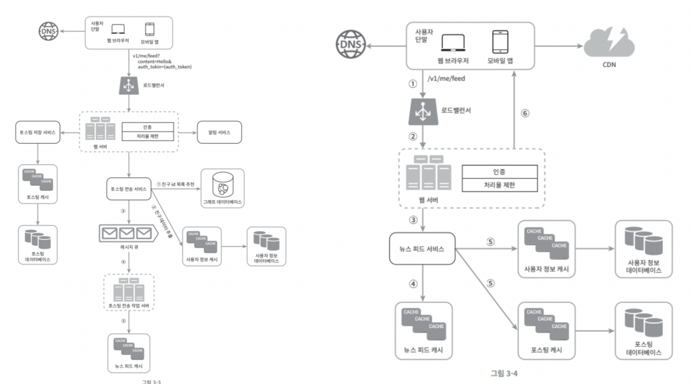

# 3. 시스템 설계 면접 공략법

 
 

# 1. 시스템 설계 면접의 이유

 

### 면접자의 입장

- 시스템 설계 면접은 두 명의 동료가 모호한 문제를 풀기 위해 협력해 그 해결책을 찾아내는 과정에 대한 시뮬레이션 입니다.
- 설계 기술을 시연하며, 그 과정에서 내린 결정들에 대한 방어 능력을 보이는 자리며 면접관의 피드백을 건설적인 방식으로 처리할 자질을 보이는 자리입니다.

 

### 면접관의 입장

- 지원자의 설계 기술적 측면 평가, 협력에 적합한 사람인지, 압박이 심한 상황도 잘 헤쳐 나가는지, 모호한 문제를 건설적으로 해결할 능력이 있는지, 좋은 질문을 던지는 능력이 있는지를 평가합니다.
- 순수하게 설계에만 집착하고, 트레이드오프를 도외시하고 오버 엔지니어링하지 않는지 판단합니다.(오버 엔지니어링은 비용 상승을 유발)
- 성격을 파악(완고함, 편협함)

  

# 2. 시스템 설계 면접의 해야할 것, 말아야 할 것

 

### 해야 할 것

- 질문을 통해 확인합니다. 스스로 내린 가정이 옳다 믿으면 절대 안됩니다. 질문을 통해 문제 요구사항을 이해 해야 합니다.
- 정답이나 최선의 답안 같은 경우는 절대 없다 생각해야 합니다.
- 면접관과 깊게 소통하여 면접관이 우리의 사고 흐름을 이해할 수 있게 해야 합니다.
- 가능하면 여러 해법을 제시해야 합니다.
- 개략적 설계에 면접관이 동의하면, 가장 중요한 컴포넌트 부터 세부사항을 설명합니다.
- 면접관에게 자주 질문하고 면접관의 아이디어를 이끌어 내야 합니다.

 

### 하지 말아야 할 것

- 전형적인 면접 문제들도 대비하지 않은 상태에서 면접장에 절대 가지 않습니다.
- 요구사항이나 가정들을 분명히 하지 않은 상태에서 설계를 제시하지 않습니다.
- 처음부터 특정 컴포넌트의 세부 사항을 너무 깊이 설명하지 않습니다. 개략적 설계를 마친 뒤 세부사항으로 나아가야 합니다.
- 침묵 속에 설계 진행을 절대 하지 않습니다.

  

# 3. 효과적 면접을 위한 4단계 접근법

 

### **1단계 : 문제 이해 및 설계 범위 확정(가장 중요)( 20% 시간 사용 )**

- 요구사항을 완벽히 이해하지 않고 답을 내놓는 행위는 아주 엄청난 감점 요인입니다. 바로 답을 하지말고 깊이 생각하고 질문하여 요구사항과 가정들을 분명히 해야 합니다.
- 요구사항에 대해 반드시 메모를 해놓습니다. 추후 관련 내용을 사용하게 됩니다.
  - 뉴스피드 시스템 설계의 순차적인 질문 예시
    - 모바일 앱과 웹 앱 가운데 어디를 지원해야 하나요? 둘 다 인가요 ?
    - 가장 중요한 기능은 뭔가요 ?
    - 뉴스 피드 정렬은 시간 역순인가요? 아니면 특별한 정렬기준이 있나요? 질문의 이유는 포스트마다 다른 가중치가 부여되야 하는지 알기 위함입니다. 가령 가까운 친구의 포스트가 사용자 그룹에 올라가는 포스트보다 더 중요하다거나하는.
    - 한 사용자는 최대 몇명의 사용자와 친구를 맺을 수 있나요 ?
    - 사이트로 오는 트래픽 규모는 어느 정도인가요 ?(답 : DAY 천만명입니다)
    - 피드에 이미지나 비디오도 올릴 수 있나요? 아니면 오로지 텍스트인가요 ?

 

## 2단계 : 개략적인 설계안 제시 및 동의 구하기( 20% 시간 사용 )

- 이 과정은 면접관과 협력하며 진행해야 합니다. 개략적 설계안을 제시하고 면접관에게 동의를 얻어야 합니다.
- 면접관과 마치 팀원처럼 대화하며 화이트보드나 종이에 핵심 컴포넌트를 포함하는 다이어그램을 그립니다. 그리고 클라이언트(모바일/웹), API, Web Server, DB, Cache, CDN, 메시지 큐 같은 것들을 포함시킵니다. 또한, 이 최초 설계안이 시스템 규모에 관계된 제약 사항들을 만족하는지 계략적인 추정치를 면접관에게 묻고 그것을 토대로 계산합니다. 계산 과정은 소리 내어 설명해야 합니다.
- 이 단계에서 API 엔드포인트나 DB 스키마도 보여야 하는가는 요구 질문에 따라 다릅니다. 구글 검색 엔진 설계와 같은 경우엔 너무 지나칠 것이고, 포커 게임 백엔드 설계는 가능할 것입니다.

 

## **3단계 : 상세 설계( 50% 시간 사용 )**

- 여기 오기 전까지 4가지를 달성해야 합니다.
  - 1 ) 시스템에서 전반적으로 달성해야 할 목표와 기능 범위 확인
  - 2 ) 전체 설계의 개략적 청사진 마련
  - 3 ) 해당 청사진에 대한 면접관의 의견 청취
  - 4 ) 상세 설계에 집중해야 할 영역들 확인
- 3단계에서 설계 대상 컴포넌트 사이의 설계 우선순위를 정해야 합니다. 이는 면접에서 시간이 없으므로 면접관이 집중적으로 설명 듣고자 하는 내용을 파악하고 그 내용위주로 설명해야 합니다. 특정 알고리즘의 동작방식 같은 불필요한 부분은 제거합니다.
- 피드 발행과 뉴스 피드 가져오기를 설계한 그림은 각각 아래와 같습니다.

 

## **4단계 : 마무리( 10% 시간 사용 )**

- 시스템 병목구간이나 개선 사항에 대한 질문이 올 수 있습니다.
- 내가 만든 설계를 다시 한번 요약해주는 것도 도움이 될 수 있습니다.
- 오류 발생시 무슨 일이 생기는지(서버 오류, 네트워크 장애 등) 따져보는 것도 좋습니다.
- 운영 이슈 논의도 좋습니다. (메트릭 수집이나 모니터링은 어떻게하고, 로그나 시스템 배포에 대한 설명)
- 미래에 닥칠 규모 확장 요구는 어떻게 대처할지 얘기하는 것도 좋습니다.

---
