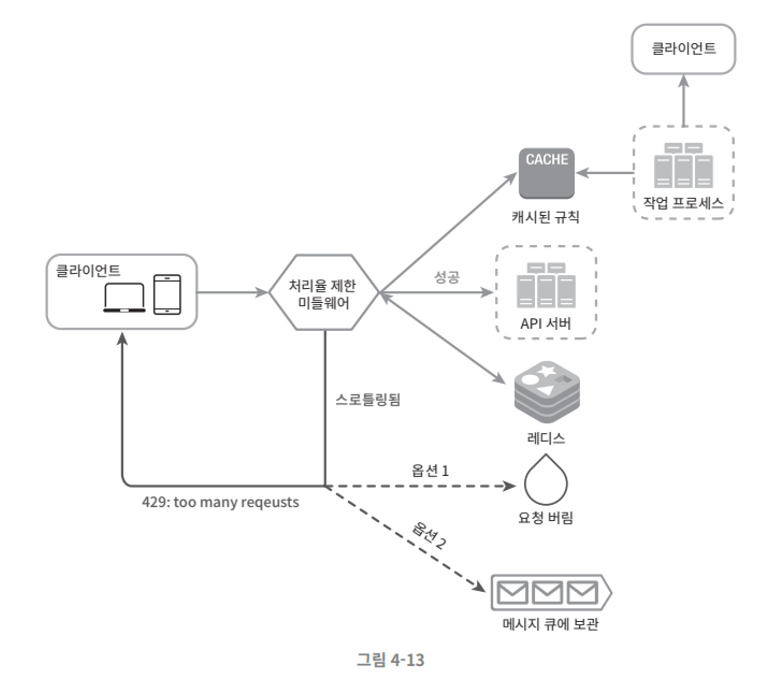

# 4. 처리율 제한 장치의 설계

  

# 1. 처리율 제한 장치란?

- 클라이언트 or 서비스가 보내는 트래픽의 처리율을 제어하기 위한 장치입니다. ( ex. 유저는 초당 2회 이상 새글을 올릴 수 없다. 같은 IP 주소로는 하루에 10개 이상 계정 생성 불가. 동일 디바이스로는 주당 5회 이상 리워드 요청 불가, 3시간 동안 300개 트윗만 생성 가능, 분당 300회의 read 연산만 가능 등.. )

  

# 2. 처리율 제한 장치의 이점

- DoS 공격에 의한 자원 고갈을 방지 할 수 있습니다.
- 불필요 요청을 제거하면 비용을 절감할 수 있습니다.

  

# 3. 처리율 제한 장치 알고리즘

- 여러 알고리즘을 사용해 구현할 수 있으며 그 각각은 고유한 장단점이 있습니다.

 

### (1) 토큰 버킷 알고리즘

- 버킷에 토큰을 원하는 시간에 추가합니다. API요청이 오면, 버킷에 토큰이 있으면 응답을 하고, 없으면 응답하지 않습니다. 버킷에 토큰은 특정 시간마다 지속적으로 채워지며 꽉차면 버립니다. 사용자의 요청이 빠르게 많이오면 버킷에 토큰이 채워지는 시간보다 줄어드는게 빨라지므로 토큰 고갈시 응답이 제한되는 원리입니다.

 

### (2) 누출 버킷 알고리즘

- 토큰 버킷 알고리즘과 비슷하지만 요청처리율이 고정되어 있다는 점이 다릅니다. 큐 크기가 꽉차지 않으면 요청을 큐에 추가합니다. 큐에 있는 데이터 처리는 정한 임의의 시간에 일정하게 처리합니다. 일정 시간 처리되는 요청보다 요청이 많이 들어오면 자연스레 큐에 요청이 들어가지 않기 때문에 요청이 버려지는 원리입니다.

 

### (3) 고정 윈도 카운터 알고리즘

- 정해진 시간 구간 동안 허용 임계값 만큼의 요청만 처리하고, 임계값 이상의 요청들은 새로운 시간 구간이 올 때 까지 버리는 방식입니다. 1초에 3건 처리라면, 1초에 5건이 들어왔을 때, 먼저 온 순서대로 3건만 처리하고 2개는 버리고, 1초 후 새 윈도우 생성하여 요청 받고 처리하기를 반복합니다.

 

### (4) 이동 윈도 로깅 알고리즘

- 로그를 지속적으로 쌓아 나가다가, 현재 시간 기준에서 시작하여 원하는 제한시간 범위까지 뒤로 가서 그 윈도우 구간 동안 온 요청을 처리하되, 시간 범위를 벗어나거나, 처리 가능 개수를 벗어나는 것은 버리는 방식입니다.

### (5) 이동 윈도 카운터 알고리즘

 

- 고정 윈도 카운터 알고리즘과 이동 윈도 로깅 알고리즘을 결합한 것입니다.

  

# 4. 처리율 제한 장치 구현 4단계

 

### 1단계 : 문제 이해 및 설계 범위 확정

- 질문 예시
  - 어떤 종류의 처리율 제한 장치를 설계해야 하나요? 클라이언트 측 제한 장치인지, 서버 측 인가요 ? ( 답변 : 서버 측 )
  - 어떤 기준을 사용해 API 호출을 제한해야 할까요? IP 주소를 사용해야 하나요? 아니면 사용자 ID나 다른 기준이 있나요? ( 답변 : 불명확, 유연한 시스템 )
  - 시스템 규모는 스타트업 기준인가요 아니면 대기업 기준인가요 ? ( 답변 : 대기업 기준 )
  - 시스템이 분산 환경에서 동작해야 하나요? ( 답변 : Yes )
  - 처리율 제한 장치는 독립된 서비스인지, 애플리케이션 코드에 포함되는지 알려주세요 ( 답변 : 마음대로 설정 )
  - 사용자의 요청이 처리율 제한에 걸러지면 사용자에게 알려야 하나요? ( 답변 : Yes )

 

### 2단계 : 개략적 설계안 제시 및 동의 구하기

- 처리율 제한 장치는 어디 둘 것인가 ?
  - 클라이언트나, 미들웨어, 서버에 두는 것을 결정합니다. 클라우드 마이크로서비스의 경우, 제한 장치는 보통 API 게이트웨이 컴포넌트에 구현됩니다.
  - 정답은 없고, 현재 기술 스택, 엔지니어 인력, 우선순위, 목표에 따라 달라집니다.
  - 사업 필요에 맞는 처리율 제한 알고리즘을 찾습니다. 서버측에서 모두 구현 해도 되지만, 제3자 제공 서비스 이용시 이 부분은 제한됩니다.
  - API 게이트웨이가 이미 있다면 게이트웨이에 처리율 제한 장치를 둡니다.
  - 처리율 제한 장치를 직접 개발시 인력과 시간이 들기에 그럴 여력이 없다면 상용 API를 써야 합니다.
- 개략적인 아키텍처
  - 처리율 제한 알고리즘의 기본 아이디어는 단순합니다. 얼마나 많은 요청이 접수되었는지를 추적할 수 있는 카운터를 추적 대상별(API, IP, 서비스단위)로 두고 이 카운터의 값이 어떤 한도를 넘으면 요청을 거부하는 것입니다. 카운터 보관에 DB는 느리기 때문에 보통 캐시를 쓰며 Redis를 많이 사용합니다.
  - 순서 : 클라이언트 → 처리율 제한 미들웨어 → 레디스에서 확인 → 결과에 따라 Drop or 서버 API 전달

 

### 3단계 : 상세 설계

- 처리율 제한 규칙은 어떻게 만들어지고 어디 저장 되는가?
  - 처리율 제한 규칙은 디스크에 보관하고, 작업 프로세스는 수시로 규칙을 디스크에서 읽어 캐시에 저장합니다.
- 처리가 제한된 요청들은 어떻게 처리 되는가?
  - 요청이 한도 제한에 걸리면 HTTP 헤더에 429 응답을 보내며 헤더에 처리 가능 요청수나 클라이언트가 전송할 수 있는 요청의 수, 언제 다시 요청을 할 수 있는지 등을 반환할 수 있습니다.
    
- 분산 환경에서의 처리율 제한 장치의 구현
  - 여러 서버와 병렬 스레드를 지원하도록 구현할 때 처리율 제한장치는 경쟁 조건(race condition)과 동기화(synchronization) 을 고려해야 합니다.
    - 경쟁 조건 해결 : 루아 스크립트 사용, 레디스 자료구조인 정렬 집합 사용
    - 동기화 이슈 해결 : 분산환경에서 여러대의 처리율 제한 장치를 사용하는데, 이 때 동기화 이슈를 해결해야 합니다. 고정 세션으로 해결 가능하나 보다 나은 해결책은 레디스와 같은 중앙 집중현 DB를 쓰는 것입니다. 데이터 동기화시 최종 일관성 모델(Eventual Consistency model)을 사용합니다.
- 모니터링
  - 처리율 제한 장치 설치 후 효과적인 동작을 보기 위해 모니터링이 필요합니다. 많은 요청이 버려지거나 효율적이지 못한 경우 수정해야 합니다.

 

### 4단계 : 마무리

- 추가적으로 논의 할 것
  - 경성 처리율 제한 : 요청 개수는 임계치를 절대 넘어설 수 없다.
  - 연성 처리율 제한 : 요청 개수는 잠시 동안은 임계치를 넘어설 수 있다.
  - 다양한 계층에서의 처리율 제한(애플리케이션 계층 말고, 다른 계층 들)

---
