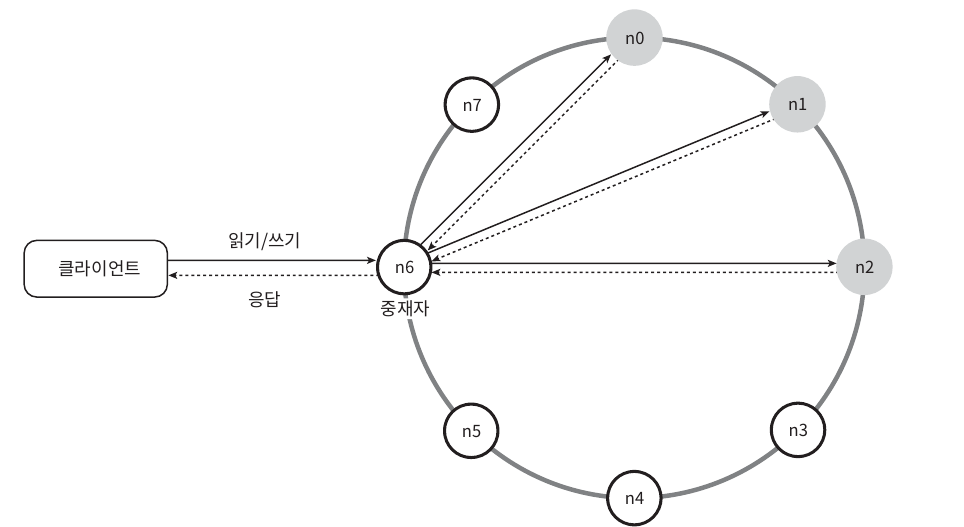
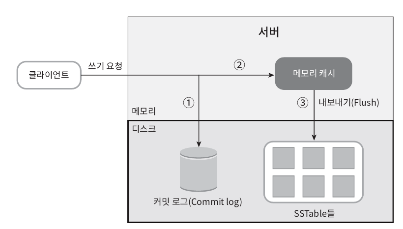
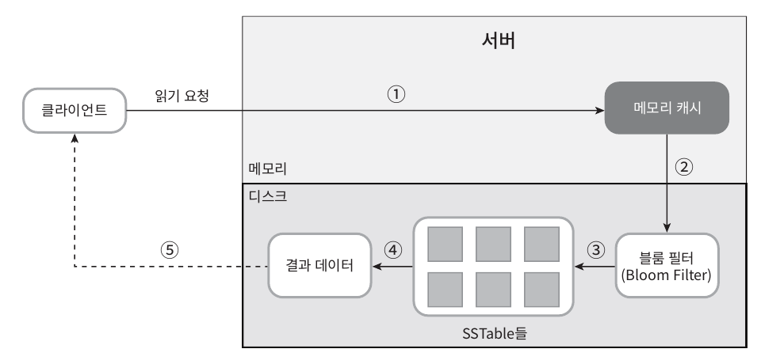

# 6. 키-값 저장소 설계

  

# 키-값 저장소란 ?

- 비 관계형 데이터베이스로, 저장되는 값은 고유 식별자를 키로 가져야합니다. 키는 유일해야 하며 해당 키에 매달린 값은 키를 통해서만 접근할 수 있습니다.
  - **키( Key ) :** 키는 일반 텍스트도 가능하고, 해시 값일 수도 있습니다. 성능상 이유로 키는 짧을수록 좋습니다.
  - **값( Value ) :** 값은 문자열, 리스트, 객체일 수도 있으며 무엇이든 상관없습니다.
  - **종류 :** 아마존 다이나모, memcached, Redis 등

  

# 문제 이해 및 설계 범위

- 질문을 통해 요구사항과 설계 범위를 정합니다. 아래는 정리된 내용 입니다.
- 키-값 쌍의 크기는 10KB 이하입니다.
- 큰 데이터를 저장할 수 있어야 합니다.
- 높은 가용성을 제공해야 하므로 시스템은 설사 장애가 있더라도 빨리 응답해야 합니다.
- 높은 규모 확장성을 제공해야 하므로 트래픽 양에 따라 자동적으로 서버 증설/삭제가 이루어져야 합니다.
- 데이터 일관성 수준은 조정이 가능해야 합니다.
- 응답 지연시간이 짧아야 합니다.

  

# 분산 키-값 저장소

 

## 1. 단일 서버의 한계점

- 단일 서버로 키-값 저장소를 만들고, 데이터 압축을 활용하고, 자주 쓰이는 데이터만 메모리를 차지하고 나머지는 디스크에 저장한다 해도 한대 서버로는 부족할 때가 옵니다. 이를 해결하기 위해 분산 키-값 저장소를 고려해야 합니다.

 

## 2. 분산 키-값 저장소 설계전 필수 지식 : CAP 정리

- 분산 시스템을 설계할 때는 CAP 정리를 이해하고 있어야 합니다.
- 분산 키-값 저장소를 만들 때, 요구사항에 맞도록 CAP 정리를 적용해야 하고, 면접관과 상의하고 결과에 따라 시스템을 설계해야 합니다.

### CAP 정리의 의미

- CAP 정리는 데이터의 일관성(Consistency), 가용성(Availability), 파티션 감내(Partition tolerance)라는 세 가지 요구사항을 동시에 만족하는 분산 시스템 설계는 불가능하다는 것을 의미합니다. 어떤 두 가지를 충족하려면 나머지 하나는 반드시 희생되어야 합니다.
  - **데이터 일관성 :** 분산 시스템에 접속하는 모든 클라이언트는 어떤 노드에 접속하더라도 항상 같은 데이터를 보게 되어야 함.
  - **가용성 :** 분산 시스템에 접속하는 클라이언트는 일부 노드에 장애가 발생하더라도 항상 응답을 받을 수 있어야 함.
  - **파티션 감내 :** 파티션은 두 노드 사이에 통신 장애가 발생하여 파티션이 생기더라도 시스템은 계속 동작해야 한다는 것을 의미.

### CAP 정리에 따른 시스템 종류

- **CP 시스템 :** 일관성 + 파티션 감내를 지원, 가용성 희생
- **AP 시스템 :** 가용성 + 파티션 감내를 지원, 일관성 희생
- **CA 시스템 :** 일관성 + 가용성 지원, 파티션 감내 희생, 그러나 네트워크 장애는 피할 수 없는 일이라 분산 시스템은 반드시 파티션 문제를 감내해야 하므로 CA시스템은 현실에서 존재하지 않음
- **CP, AP 예시**
  - 노드1, 2, 3이 있을 때 노드 3이 망가졌다면 CP 시스템은 일관성 유지를 위해 노드1과 노드2의 쓰기 연산을 중단합니다. 그래야 노드 3과 같은 데이터가 유지되기 때문입니다. 이렇게 되면 자연스럽게 가용성이 저해됩니다. 반대로 AP시스템은 일관성이 깨지더라도 계속 쓰기, 읽기 연산을 허용합니다. 그 후 파티션 문제가 해결된 뒤에 데이터를 노드3에 전달할 것입니다.

 

## 3. 키-값 저장소 구현 시 핵심 시스템 컴포넌트

### 1) 데이터 파티션

- 대규모 애플리케이션 설계 시 데이터를 여러 서버에 저장하도록 해야 합니다. 이때 두 가지를 고려합니다.
  - (1) 데이터를 여러 서버에 고르게 분산할 수 있는가
  - (2) 노드가 추가되거나 삭제될 때 데이터의 이동을 최소화할 수 있는가
- 안정 해시를 사용해 데이터 파티션 진행
  - 부하에 따라 서버를 자동으로 삭제, 추가할 수 있고 / 고성능 서버는 가상 노드를 더 많이, 아닌 것은 용량에 맞게 가상 노드를 추가할 수 있어 좋습니다.

### 2) 데이터 다중화(replication)

- 높은 가용성과 안정성을 확보하기 위해 데이터를 여러 서버에 비동기적으로 다중화 해야 합니다.

### 3) 일관성(consistency)

- 여러 노드에 다중화된 데이터는 적절히 동기화되어야 합니다. 정족수 합의 프로토콜을 사용해 읽기/쓰기 연산 모드에 일관성을 보장할 수 있습니다.
- 노드 N개, 쓰기 연산 정족수 W, 읽기 연산 정족수 R이 있다면 W,R의 수치는 아래와 같이 정할 수 있습니다.
  - R=1, W=N : 빠른 읽기 연산에 최적화된 시스템
  - W=1, R=N : 빠른 쓰기 연산에 최적화된 시스템
  - W + R > N : 강한 일관성이 보장됨(보통 N = 3, W=R=2)
  - W + R ≤ N : 강한 일관성이 보장되지 않음
- **일관성 모델**
  - **강한 일관성 모델 :** 모든 읽기 연산은 가장 최근 갱신된 결과만 받으며, 절대 낡은 데이터를 볼 수 없는 것을 말합니다. 이를 위해 모든 사본에 현재 쓰기 연산의 결과가 반영될 때 까지 해당 데이터에 대한 읽기/쓰기가 금지됩니다. 이로써 고가용성 시스템에는 적합하지 않습니다.
  - **약한 일관성 모델 :** 읽기 연산은 가장 최근 갱신된 결과를 받지 못할 수도 있는 것입니다.
  - **결과적 일관성 모델 :** 약한 일관성의 한 형태로 갱신 결과가 결국에는 모든 사본에 동기화되는 모델입니다.

### 4) 일관성 불일치 해소(inconsistency resolution) : 데이터 버저닝

- 데이터 다중화시 가용성은 높아지나 사본 간 일관성이 깨질 수 있죠. 이를 위해 버저닝과 벡터 시계 기술로 문제 해결이 가능합니다.
  - **버저닝 :** 버저닝은 데이터 변경시마다 해당 데이터의 버전을 업데이트하는 것입니다.
  - **벡터 시계 :** 벡터 시계는 [서버, 버전]의 순서쌍을 데이터에 매단 것입니다. Data([server1, 1],[server2,2]) 어떤 버전이 선행인지, 후행인지, 충돌했는지 등을 판단할 때 쓰입니다.
    - **단점 :** 충돌 감지 해소 로직이 클라이언트단에 들어가야 하므로 구현 난이도 상승 및 [서버:버전]의 순서쌍 개수가 굉장히 빨리 늘어납니다.

### 5) 장애 처리

- **장애 감지**
  - 보통 두 대 이상의 서버가 한 서버에 대해 장애 발생 알림을 해야 장애가 발생했다고 간주합니다. 모든 노드 사이에 멀티캐스팅 채널을 구축하면 서버 장애를 쉽게 탐지할 수 있으나 서버가 많아지면 가십 프로토콜을 채택하는게 유리합니다.
    - **가십 프로토콜 :** 각 노드 하나하나가, 모든 노드에 살아있는지 묻는 것이 아닌, 각 노드들은 자기들이 선택한 랜덤한 노드 몇 개만 골라 주기적으로 그 노드들에게 살아있는지 질의를 보냄, 특정 노드가 살아있는지 유무를 확인 시간이 일정 시간 이상이면 죽은 것으로 판단합니다.
- **일시적 장애 처리**
  - 가십 프로토콜로 장애를 확인한 시스템은 엄격한 정족수 접근법을 쓴다면 데이터 일관성을 위해 읽기, 쓰기 연산을 금지해야 할 것입니다. 느슨한 정족수를 사용한다면, 정족수 요구사항을 강제하는 대신, 쓰기, 읽기 연산을 수행할 서버를 각각 골라 처리하게 합니다.
- **영구 장애 처리**
  - 반-엔트로피 프로토콜을 구현해 사본들을 동기화합니다.
- **데이터 센터 장애 처리**
  - 여러 데이터센터에 데이터를 다중화합니다.

### 6) 시스템 아키텍처 다이어그램

- 클라이언트는 키-값 저장소가 제공하는 두 가지 단순한 API, 즉 GET, PUT 함수와만 통신합니다.
  
- 중재자 노드는 클라이언트에게 키-값 저장소에 대한 프록시 역할을 하는 노드입니다.
- 노드는 안정 해시의 해시 링 위에 분포합니다.
- 노드가 자동으로 추가, 삭제될 수 있도록 시스템은 완전히 분산합니다.
- 데이터는 여러 노드에 다중화 합니다.
- 모든 노드가 같은 책임을 가지므로 SPOF(Single Point of Failure)는 존재하지 않습니다.

### 7) 쓰기 경로

- 쓰기 요청이 왔을 때의 흐름입니다.

- (1) 커밋 로그 파일에 이력 기록
- (2) 데이터가 캐시 메모리에 기록
- (3) 메모리 캐시가 가득 차거나 사전에 정의된 어떤 임계치에 도달 시 Sorted-String table (키,값의 순서쌍을 정렬된 리스트로 관리하는 테이블)에 저장

### 8) 읽기 경로

- 읽기 요청 시 캐시 메모리에 데이터가 있으면 바로 반환하며 없으면 아래 그림과 같은 흐름을 따릅니다.

- (1) 메모리 캐시에 데이터가 있으면 반환
- (2) 없으면 블룸 필터를 검사
- (3) 블룸 필터를 통해 어떤 SSTable에 키가 보관되었는지 확인
- (4, 5) 해당 SSTable에서 데이터를 가져와 클라이언트에 반환

  

# 정리

- **대규모 데이터 저장 :** 안정 해시를 사용해 서버들에 부하 분산
- **읽기 연산에 대한 높은 가용성 보장 :** 데이터를 여러 데이터센터에 다중화
- **쓰기 연산에 대한 높은 가용성 보장 :** 버저닝 및 벡터 시계를 사용한 충돌 해소
- **데이터 파티션 or 점진적 규모 확장성 or 다양성 :** 안정 해시 사용
- **조절 가능한 데이터 일관성 :** 정족수 합의(quorum consensus)
- **일시적 장애 처리 :** 느슨한 정족수 프로토콜과 단서 후 임시 위탁(hinted handoff)
- **영구적 장애 처리 :** 머클 트리(Merkle tree)
- **데이터 센터 장애 대응 :** 여러 데이터 센터에 걸친 데이터 다중화

  

# 키-값 저장소 설계 면접 시나리오

- (1) CAP 이론에 따라 가용성, 일관성 어느 것에 중점을 둘지 묻고 답변을 받아 그에 따라 설계를 진행
- (2) 가용성 중점 : 데이터 다중화
- (3) 일관성 중점 : 정족수 합의 프로토콜 사용, 일관성 불일치 해소를 위해 데이터 버저닝, 벡터 시계 사용
- (4) 공통 : 장애 감지, 가십 프로토콜
- (5) 시스템 아키텍처 : 클라이언트는 GET, PUT API만 사용, 중재자 노드를 두어 클라이언트에게 키-값 저장소에 대한 프록시 역할, 노드는 안정 해시의 해시 링 위에 분포, 데이터는 여러 노드에 다중화
- (6) 읽기 : 캐시 메모리에 데이터가 있다면 바로 반환, 없다면 블룸 필터 검사를 통해 SSTable 어디에 데이터가 있는지 확인 후 반환
- (7) 쓰기 : 요청을 커밋 로그에 기록, 데이터를 캐시 메모리에 기록, 특정 조건 시 캐시 메모리를 SSTable에 저장

---
