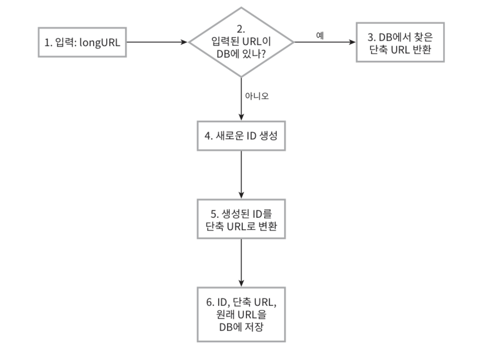
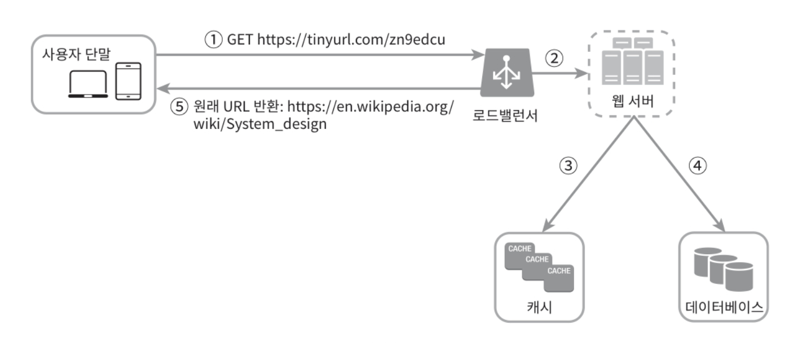

# 8. URL 단축기 설계

  

# 1단계 : 문제 이해 및 설계 범위 확정

 

시스템 설계 문제는 의도적으로 정답을 정해 놓지 않습니다. 성공적인 설계를 해 나가려면 질문을 통해 모호함을 줄이고 요구사항을 알아내야 합니다.

- **질문 :** URL 단축기가 어떻게 동작해야 하는지 예제를 보여주실 수 있을까요?
  - **답 :** https://www.naver.com/q=hi&c=lo 으로 주어진다면, 이 서비스는 https://tinyurl.com/y7ke-39 와 같이 줄여져야 합니다.
- **질문 :** 트래픽 규모는 어느 정도이고, 단축 URL의 길이는 어느 정도 여야 하나요?
  - **답 :** 매일 1억 개의 단축 URL을 만들어 낼 수 있어야 하며 길이는 짧을수록 좋습니다.
- **질문 :** 단축 URL에 포함될 문자에 제한이 있나요?
  - **답 :** 0~9까지와 A~Z, a~z만 사용 가능합니다.
- **질문 :** 단축 URL을 시스템에서 지우거나 갱신 가능한가요?
  - **답 :** 삭제나 갱신은 불가하다 가정합니다.
- **개략적 추정**
  - **쓰기 :** 매일 1억 개 단축 URL 생성, 초당 1억/24/3600 = 1160개 생성
  - **읽기 :** 읽기 쓰기 비율이 10 : 1이라고 가정하면 초당 11,600회 발생한다.
  - URL 단축 서비스를 10년 운영한다 가정하면 1억*365*10 = 3650 억개 레코드 보관
  - 축약전 URL 평균 길이 100이라 가정, 10년간 필요한 저장 용량은 100Byte \* 3650억 = 36.5TB

  

# 2단계 : 개략적 설계안 제시 및 동의 구하기

 

## (1) API 엔드 포인트

- **POST :** 사용자가 단축용 API를 받기 위해 단축할 URL을 보낼 엔드 포인트가 하나 필요합니다.
- **GET :** 단축한 URL에 대해 HTTP 요청이 오면 원래 URL로 보내주기 위한 엔드 포인트가 필요합니다.

 

## (2) URL리디렉션

- 단축 URL을 받은 서버는 그 URL을 원래 URL로 바꾸어 301 응답의 Location 헤더를 넣어 반환합니다. 301응답을 받은 브라우저는 원래 URL을 로드합니다.
- **301과 302 응답의 차이점**
  - **301 Permanently Moved :** 이 응답은 해당 URL에 대한 HTTP 요청의 처리 책임이 영구적으로 Location 헤더에 반환된 URL로 이전되었다는 응답입니다. 영구적으로 이전되었으므로, 브라우저는 이 응답을 캐시(Cache) 합니다. 따라서 추후 같은 단축 URL에 요청을 보낼 필요가 있을 때 브라우저는 캐시 된 원래 URL로 요청을 보내게 됩니다.
  - **302 Found :** 이 응답은 주어진 URL로 요청이 ‘일시적’으로 Location 헤더가 지정하는 URL에 의해 처리되어야 한다는 응답입니다. 따라서 클라이언트의 요청은 언제나 단축 URL 서버에 먼저 보내진 후에 원래 URL로 리디렉션되어야 합니다.
  - **장단점 :** 301을 쓰면 서버 부하를 줄이는데 좋고, 302를 쓰면 트래픽 분석이 중요할 때 씁니다.

 

## (3) URL 단축

- 보통 해시 함수를 사용합니다. 이 해시 함수는, 입력으로 주어지는 긴 URL이 다른 값이면 해시 값도 달라야 하고, 변환된 해시값은 원래의 URL로 복원될 수 있어야 합니다.

  

# 3단계 : 상세 설계

 

## (1) 데이터 모델

- 단순히 메모리에 저장하는 것은 비효율적이기 때문에 <단축 URL, 원래 URL>의 순서 쌍을 관계형 데이터베이스에 저장해야 합니다.

 

## (2) 해시 함수

- 해시 함수는 원래 URL을 단축 URL로 변환하는데 쓰입니다.
- **해시 값의 길이 :** 단축 URL의 사용 가능 문자가 0~9, a-Z까지 총 62개이고, 총 3650억 개 생성이 가능해야 하기 때문에 62^n이 3650억 개보다 커지는 n을 찾아야 합니다. n이 7이면 3.5조 개의 URL을 만들 수 있습니다. 이로써 해시 값의 길이는 7로 합니다.

 

## (3) 해시 함수 구현

- **해시 후 충돌 해소 방법**
  - 잘 알려진 해시 함수들(CRC32, MD5, SHA-1)을 통해 먼저 url을 단축합니다. 해시 함수 특성상 충돌이 발생할 수 있습니다. 그리고 단축 후 해시 값의 길이가 7을 넘어가면 줄여야 합니다. 가장 간단한 방법은 긴 문자를 일단 7개만 사용하는 것으로 해서 DB에 같은 것이 있나 확인합니다. 없다면 그대로 7개만 저장, 있다면 임의의 문자 추가 후 있는지 확인하고 저장하는 방식으로 만듭니다. 이 방법은 DB를 계속 확인해야 하므로 오버헤드가 큽니다. 데이터베이스 대신 블룸 필터를 사용하면 성능을 높일 수 있습니다.
- **base-62 변환 방법**
  - 진법 변환은 URL 단축기 구현 시 흔히 사용되는 접근법 중 하나입니다. 원래의 URL을 받으면 해당 URL을 DB에서 확인하고 없으면 새로운 ID를 생성합니다. 그 후 ID를 62진법으로 변환하는 것입니다. 이렇게 되면 충돌은 아예 불가능하며, 원래 URL이 노출될 일도 없습니다.

| **해시 후 충돌 해소 전략**                                            | **Base-62 변환**                                                                          |
| --------------------------------------------------------------------- | ----------------------------------------------------------------------------------------- |
| 단축 URL의 길이가 고정됩니다.                                         | 단축 URL의 길이가 가변 적이고, ID가 커지면 길어집니다.                                    |
| 유일성이 보장되는 ID 생성기가 필요 없습니다.                          | 유일성 보장 ID가 필요합니다.                                                              |
| 충돌이 가능해서 해소 전략이 필요합니다.                               | ID의 유일성이 보장된 후 적용 가능하므로 충돌 자체가 불가합니다.                           |
| ID로부터 단축 URL을 계산하지 않아 다음에 쓸 URL을 알아낼 수 없습니다. | ID로부터 URL을 만들기 때문에 다음에 쓸 단축 URL을 알 수 있어 보안상 문제 소지가 있습니다. |

 

## (4) URL 단축기 상세 설계

 

## (5) URL 리디렉션 상세 설계

- 1 ) 사용자가 단축 URL을 클릭합니다.
- 2 ) 로드밸런서가 해당 클릭으로 발생한 요청을 웹 서버에 전달합니다.
- 3 ) 단축 URL이 이미 캐시에 있다면 원래 URL을 바로 클라이언트에게 전달합니다.
- 4 ) 캐시에 단축 URL이 없다면 데이터베이스에서 꺼내 전달합니다.
- 5 ) 데이터베이스에서 꺼낸 URL을 캐시에 저장 후 사용자에게 반환합니다.

  

# 4단계 : 마무리( 추가적으로 나눌 내용 )

 

- **처리율 제한 장치 :** 많은 트래픽을 감당해야 할 때 불필요한 요청을 제거할 용도로 처리율 제한 장치를 제안합니다.
- **데이터 분석 솔루션 :** 성공적인 비즈니스를 위해서는 데이터가 중요합니다. URL 단축기에 데이터 분석 솔루션을 통합해 두면 어떤 링크를 얼마나 많은 사용자가 클릭했는지, 언제 주로 클릭한지 알 수 있습니다.
