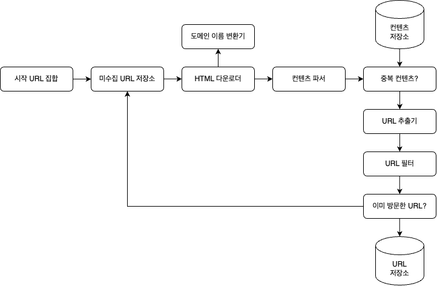
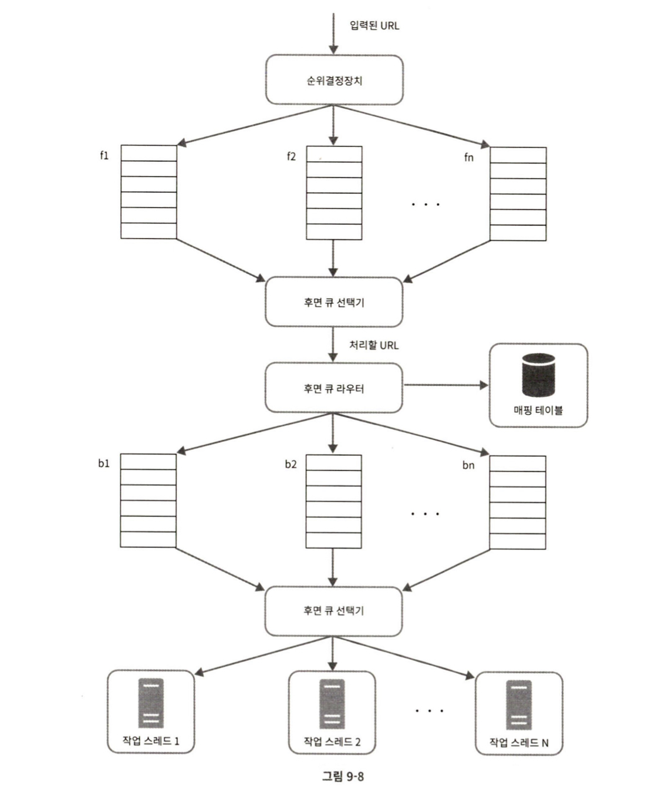
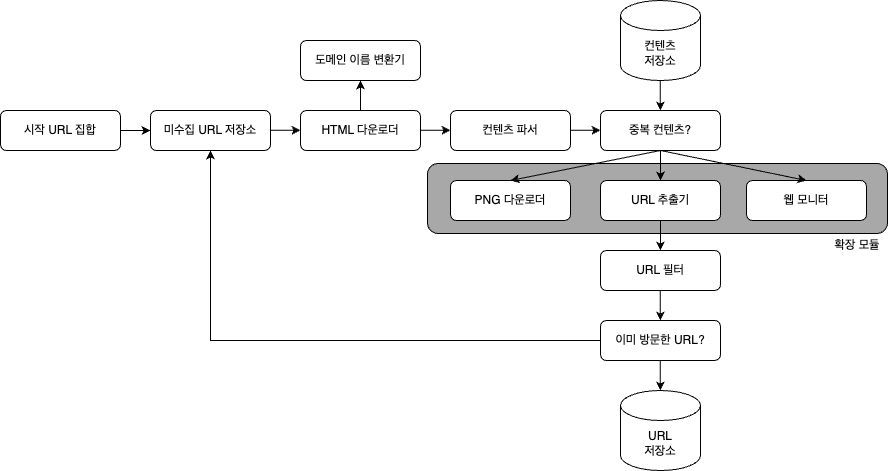

# 9. 웹 크롤러 설계

  

# 크롤러란 ?

- 웹 크롤러는 검색 엔진에서 널리 쓰는 기술로, 웹에 새로 올라오거나 갱신된 콘텐츠를 찾아내는 것을 목적으로 합니다.

 

# 크롤러의 쓰임

- **검색 엔진 인덱싱 :** 크롤러는 웹 페이지를 모아 검색 엔진을 위한 로컬 인덱스를 만듭니다.
- **웹 아카이빙 :** 추후 사용을 목적으로 장기 보관하기 위해 웹에서 정보를 모으는 것입니다.
- **웹 마이닝 :** 인터넷을 통해 유의미한 자료를 추출해 내는 것입니다.
- **웹 모니터링 :** 저작권이나 상표권 침해 사례를 모니터링하는 것입니다.

 

# 웹 크롤러 알고리즘

- URL 집합이 입력으로 주어지면 해당 URL들이 가리키는 모든 웹페이지를 다운로드합니다 → 다운로드한 웹 페이지에서 URL들을 추출합니다 → 추출된 URL들을 다운로드할 URL 목록에 추가하고 처음부터 반복합니다.

  

# 1단계 : 문제 이해 및 설계 범위 확장

 

## 질문을 통한 문제 정의

- **질문 :** 크롤러의 주된 용도는 무엇인가요 ? 검색 엔진 인덱스 생성용인지, 데이터 마이닝인지, 그 외 용도인가요 ? ( **답변 :** 검색 엔진 인덱싱에 쓰입니다. )
- **질문 :** 매달 얼마나 많은 웹 페이지를 수집해야 하나요? ( **답변 :** 10억 개의 웹 페이지를 수집해야 합니다. )
- **질문 :** 새로 만들어진 웹 페이지나 수정된 웹 페이지도 고려해야 하나요 ? ( **답변 :** 네 )
- **질문 :** 수집한 웹 페이지는 저장해야 하나요? ( **답변 :** 5년간 저장합니다. )
- **질문 :** 중복 콘텐츠는 어떻게 하나요? ( **답변 :** 무시합니다. )

 

## 주요 고려 사항

- **규모 확장성 :** 웹은 수십억 개가 넘으므로 병행성을 활용하여 보다 높은 성능을 고려해야 합니다.
- **안정성 :** 탐색 시 장애, 악성코드, 무응답 등의 환경에 대응할 수 있어야 합니다.
- **예절 :** 대상 웹사이트에 너무 많은 요청을 짧은 시간에 보내면 안 됩니다.
- **확장성 :** 새로운 콘텐츠 지원이 쉬워야 합니다. 크롤러에 이미지 검색 기능 추가 시 설계를 다시 한다면 큰 손해이기 때문입니다.

 

## 개략적 규모 추정

- 매달 10억 개의 웹페이지 다운로드 QPS = 10억/30일/24시간/3600초 = 대량 초당 400페이지, 최대 QPS는 2배인 800
- 웹 페이지 평균 크기는 500k라고 가정, 10억 페이지 * 500k = 500TB/월 , 5년간 보관시 500TB *12\*5 = 30PB 저장용량이 필요

  

# 2단계 : 개략적 설계안 제시 및 동의 구하기

 

 

### (1) 시작 URL 집합

- 크롤링 시작의 출발점입니다. 가능한 한 많은 링크를 탐색할 수 있도록 시작 url을 고르는 것이 좋습니다. 쇼핑, 스포츠, 건강 등 카테고리별로 시작 url을 해도 좋습니다.

 

### (2) 미수집 URL 저장소

- 큐입니다.

 

### (3) HTML 다운로더

- 웹 페이지를 다운로드하는 컴포넌트입니다. 미수집 URL 저장소에서 URL을 가져와 도메인 이름 변환기를 사용해 URL의 IP 주소를 알아낸 후 IP 주소로 접속해 다운로드합니다

 

### (4) 도메인 이름 변환기

- 웹페이지 다운로드 시 URL을 IP 주소로 변환해야 합니다. HTML 다운로더는 도메인 이름 변환기를 사용해 URL에 대응되는 IP 주소를 알아냅니다.

 

### (5) 콘텐츠 파서

- 웹 페이지를 다운로드한 후 파싱과 검증을 거쳐 이상하거나 의미 없는 페이지를 제거합니다. 크롤링 서버 안에서 콘텐츠 파서를 구현하면 크롤링 과정이 느려지기 때문에 독립된 컴포넌트로 만듭니다.

 

### (6) 콘텐츠 저장소

- HTML 문서 보관 시스템입니다. 저장소 구현 시 데이터의 유형, 크기, 접근 빈도, 유효 기간 등을 종합적으로 고려해 설계합니다. 디스크와 메모리를 적절히 활용해 설계합니다.

 

### (7) 중복 콘텐츠

- 웹 페이지의 해시 값을 비교해 빠르게 파악합니다. URL 저장소에 없는 콘텐츠만 저장소에 저장하고 URL 추출기로 내용을 전달합니다.

 

### (8) URL 추출기

- HTML 페이지 파싱 후 링크들을 골라내는 역할을 하며 상대 경로는 도메인을 붙여 온전한 URL로 만듭니다.

 

### (9) URL 필터

- 접근하지 않을 URL을 필터링하는 역할을 합니다.

 

### (10) 이미 방문한 URL

- 이미 방문했거나, 미수집 URL에 있는 정보를 파악하기 위해 별도의 해시 테이블이나 블룸 필터가 쓰입니다.

 

### (11) URL 저장소

- 이미 방문한 URL을 보관합니다.

  

# 3단계 : 상세 설계

 

- **후면 큐라우터 :** 매핑 테이블을 만들어 같은 호스트에 속한 URL은 언제나 같은 큐로 가도록 보장합니다.
- **후면 큐 선택기 :** 큐들을 순회하면서 큐에서 URL을 꺼내 URL을 다운로드하도록 작업 스레드에 보내는 역할을 합니다.
- **작업 스레드 :** URL을 받아 다운로드하며 작업들 사이에는 일정 지연시간을 둘 수 있습니다.
- **우선순위**
  - 페이지 랭크, 트래픽 양, 갱신 빈도 등 다양한 척도를 사용해 우선순위를 정한 뒤 먼저 수집되도록 할 수 있습니다.
  - **순위 결정 장치 :** URL을 입력받아 우선순위를 계산합니다.
  - **큐( f1 … fn ) :** 우선순위별로 큐가 하나씩 할당됩니다. 우선순위가 높으면 선택될 확률도 올라갑니다.
  - **전면 큐선택기 :** 임의 큐에서 처리할 URL을 꺼내는 역할을 담당합니다. 순위가 더 높은 큐에서 더 자주 꺼내도록 프로그래밍합니다.

 

## DFS vs BFS

- DFS 탐색은 그래프 크기가 클수록 비효율적이기에 BFS를 많이 사용합니다. BFS 사용 시, 같은 웹페이지의 모든 페이지를 방문하게 되면 대상 서버에 무리가 갑니다.
- 동일 웹 사이트에 대해서는 한 번에 한 페이지만 요청하도록 합니다. 이를 위해 같은 웹 사이트의 페이지 다운 작업은 시간차를 두고 실행하도록 합니다.

 

## 신선도

- 웹 페이지는 수시로 추가, 삭제, 갱신되므로 이미 다운로드한 페이지를 주기적으로 재 수집해야 합니다. 모든 것을 재수집할 수 없기 때문에 웹 페이지의 변경 이력을 활용하거나, 우선순위를 활용해 중요한 페이지는 좀 더 자주 수집합니다.

 

## 미수집 URL 저장소

- 대부분의 URL은 디스크에 두지만 I/O 비용을 줄이기 위해 메모리 버퍼에 큐를 두어 버퍼에 있는 데이터는 주기적으로 디스크에 기록합니다.

 

## HTML 다운로더

- HTTP 프로토콜을 통해 HTML을 다운로드 하기전, Robots.txt 파일을 보고 받을 수 없는 내용을 파악합니다.
- **다운로더 성능 최적화**
  - **분산 크롤링 :** 크롤링 작업을 여러 서버에 분산하는 것으로, 각 서버는 여러 스레드를 돌려 다운로드 작업을 처리합니다.
  - **도메인 이름 변환 결과 캐시 :** 크롤러 성능 병목 중 하나가 DNS 요청을 보내고 결과를 기다리는 시간입니다. 결과를 받으면 도메인 이름과 IP 주소 사이의 관계를 캐시에 보관해 놓고 크론 잡등을 돌려 주기적으로 갱신하도록 해야 합니다.
  - **짧은 타임아웃 :** 어떤 웹서버는 응답이 느리거나 응답이 없으므로 최대 대기 시간을 정해야 합니다.
- **다운로더 안정성**
  - **안정 해시 :** 다운로더 서버들의 부하를 분산하기 위해 사용합니다.
  - **크롤링 상태 및 수집 데이터 저장 :** 장애 발생 시 복구가 가능하도록 주기적으로 크롤링 상태와 수집 데이터를 디스크에 저장합니다.
  - **예외 처리 :** 에러 발생 시 SPOF가 되지 않게 처리합니다.
  - **데이터 검증 :** 시스템 오류 방지를 위해 필요합니다.

 

## 확장성

- 확장성을 고려해 아래와 같이 설계합니다.

 

## 문제 콘텐츠 감지 및 회피

- **중복 방지 :** 해시나 체크섬을 사용해 중복을 제거합니다.
- **거미 덫 :** 크롤러를 무한 루프에 빠뜨리도록 설계한 웹페이지가 있습니다. 이를 피하기 위해 URL의 최대 길이를 제한합니다. 그래도 사실상 다 막기는 불가능해서 직접 찾아서 제외하거나 필터 대상에 놓아야 합니다.
- **데이터 노이즈 :** 광고, 스팸 같은 것은 버려야 합니다.

  

# 4단계 : 마무리 ( 추가로 나눌 내용 )

 

- **데이터베이스 다중화 및 샤딩 :** 다중화나 샤딩 같은 기법을 적용해 데이터 계층의 가용성, 규모 확장성, 안정성 향상을 도모합니다.
- **수평적 규모 확장성 :** 대규모 크롤링을 위해서는 다운로드를 실행할 서버가 수백 혹은 수천 대 필요하게 될 수 있습니다. 수평적 규모 확장성을 달성하는 데 중요한 것은 서버가 상태 정보를 유지하지 않도록 하는 것으로 무상태 서버로 만드는 것입니다.
- **가용성, 일관성, 안정성 :** 대규모 시스템의 필수 사항
